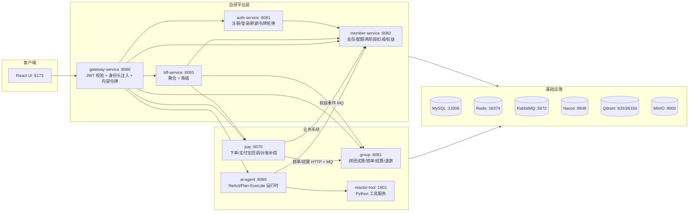

# AI-Group：网页 Agent + 拼团支付一体化平台

一个面向 C 端的「AI 网页 Agent」平台：用户注册后通过**拼团**方式购买会员，支付宝支付成团后获得会员权益与对话配额，再进入多智能体运行时进行 ReAct / Plan-Execute 流式对话。项目由一层自研微服务平台聚合三套业务系统组成，覆盖网关鉴权、认证、会员配额、拼团、支付、Agent 运行时与前端的完整链路。

> 技术基线：JDK 21、Spring Boot 3.5.16、Spring Cloud 2025.0.3、Spring Cloud Alibaba 2025.0.0.0、Spring AI 1.1.x、React 19 + Vite 6。

---

## 1. 架构总览



数据流（主链路）：注册 → 登录 → 定价 → 拼团下单 → 支付宝支付 → 成团结算（HTTP + MQ 双通道）→ 权益事件（本地消息表 outbox）→ member 开通 Pro + 发放配额 → Agent 对话按 `预扣→确认/释放` 计费。

## 2. 模块职责

| 模块 | 端口 | 包名 / 技术 | 职责 |
|------|------|------|------|
| `gateway-service` | 8080 | `com.aigroup.gateway` / Spring Cloud Gateway (WebFlux) | 统一 JWT 校验、身份头注入与下游剥离、内部回调令牌校验、CORS |
| `auth-service` | 8081 | `com.aigroup.auth` / JJWT + BCrypt | 注册/登录/登出/刷新（Redis 刷新令牌原子轮换 + 访问令牌黑名单） |
| `member-service` | 8082 | `com.aigroup.member` / MyBatis-Plus | SKU、配额账户、`freeze→confirm/release` 两阶段扣减、按订单幂等的权益发放/撤销、月度重置、DLQ |
| `bff-service` | 8083 | `com.aigroup.bff` / OpenFeign | 聚合 member/group/pay，带降级（degrade）元信息 |
| `ai-group-common` | - | `com.aigroup.common` | JWT 工具、内部令牌属性、统一 Result/异常、身份头过滤器 |
| `group` | 8091 | `com.aigroup.groupbuy` / DDD 六模块 | 拼团试算责任链、四类折扣计算器、锁单/结算/退款规则链、超时补偿、本地消息表 |
| `s-pay-mall-ddd-market` | 8070 | `com.aigroup.paymall` / DDD 六模块 | 下单/掉单恢复、支付宝沙箱回调（验签+金额+幂等）、拼团锁单结算、退款、对账补偿 Job |
| `ai-agent` | 8090 | `org.wwz.ai` / Spring AI | 多智能体运行时：ReAct + Plan-Execute、工具系统、技能系统、执行账本回放、配额计费 |
| `ai-agent/reactor-tool` | 1601 | Python (uv) | deep_search / web_fetch / 图片生成 / 脚本沙箱 / embedding 等工具 |
| `ai-agent/ui` | 5173 | React 19 + Vite + antd | 聊天/定价/订单前端，SSE 流式消费 |

## 3. 快速开始

### 前置依赖

- **Docker Desktop**（基础设施）
- **JDK 21** + **Maven 3.9+**
- **Node 18+** + **pnpm**
- **PowerShell 7（`pwsh`）** — 启动脚本使用了 PowerShell 7 语法，**Windows 自带的 5.1 会解析报错**
- （可选）**Python + uv** — 仅 reactor-tool 需要
- 一个 DashScope（阿里百炼，兼容 OpenAI 协议）API Key

### 一键启动（推荐）

```powershell
# 1. 复制环境变量模板并填入真实 Key
Copy-Item .env.example .env
# 编辑 .env，至少填入 AGENT_GROUP_LLM_API_KEY / DASHSCOPE_API_KEY

# 2. 用 PowerShell 7 一键起：Docker 基础设施 + DB 初始化 + 构建 + 7 个服务 + 前端 + 冒烟
pwsh -NoProfile -ExecutionPolicy Bypass -File docs/dev-ops/start-full-stack.ps1
```

启动完成后：前端 http://localhost:5173/login ，网关 http://localhost:8080 。

### 手动启动

```bash
# 基础设施
cd docs/dev-ops && docker compose -f docker-compose-platform.yml up -d

# 构建
mvn clean install -DskipTests
cd group && mvn clean install -DskipTests
cd ../s-pay-mall-ddd-market && mvn clean install -DskipTests

# 按序启动各服务（见端口表），前端：
cd ai-agent/ui && pnpm install && pnpm dev
```

## 4. 端口清单

| 类别 | 服务 | 端口 |
|------|------|------|
| 平台 | gateway / auth / member / bff | 8080 / 8081 / 8082 / 8083 |
| 业务 | pay / agent / group / reactor-tool | 8070 / 8090 / 8091 / 1601 |
| 前端 | Vite dev server | 5173 |
| 基础设施 | MySQL / Redis / RabbitMQ | 13306 / 16379 / 5672(15672) |
| 基础设施 | Nacos / Qdrant / MinIO | 8848 / 6333(6334) / 9000(9001) |

## 5. 验证脚本

```powershell
# 平台冒烟：注册→登录→定价→会员摘要（FREE + 20 点）
pwsh docs/dev-ops/smoke-test.ps1
# 权益链路：模拟成团 MQ → 开通 Pro + 发放配额
pwsh docs/dev-ops/smoke-benefit-event.ps1
# 端到端：下单→内部回调结算→权益→会员升级 PRO
pwsh docs/dev-ops/verify-e2e.ps1
# 安全冒烟：直连/伪造头/无令牌回调均应被拒
pwsh docs/dev-ops/smoke-security.ps1
```

## 6. 技术亮点

- **执行账本 + 历史回放（event sourcing）**：`dialogue_run / llm_invocation / tool_invocation / artifact_record` + 按工具类型分表，支持会话历史精确回放。
- **三层对话记忆**：短期（单 run 上下文）/ 中期（会话滚动摘要压缩，替代硬截断，落 MySQL 账本）/ 长期（跨会话 Qdrant 向量召回 + 时间衰减遗忘），由 `ConversationMemoryManager` 统一组装注入，ReAct/Plan/chat 共用，Qdrant 不可用时 fail-open。
- **循环/工具/幻觉兜底三件套**：ReAct 死循环检测 + 步数上限可识别终止；工具失败有界重试 + 结构化错误回喂；抗幻觉约束 prompt。断开即停释放配额、per-user 并发限流、崩溃遗留冻结配额兜底释放 job。
- **可度量的最小评测集**：经 Gateway 跑真实 SSE，输出任务成功率、p50/p95 时延、平均步数/token、工具轨迹命中与可选 LLM-as-judge 打分（见 `docs/evals`）。
- **Claude-skills 风格技能系统**：`SKILL.md` 解析 + 路径沙箱 + `read/grep/glob/list/skill/script_runner` 工具族。
- **两阶段配额扣减**：Agent 对话 `预扣(freeze)→确认(confirm)/释放(release)`，按执行账本 run 终态结算，`settled` CAS 保证至多一次。
- **支付一致性**：支付宝回调「验签 + 金额比对 + 订单存在性 + SQL 状态守卫」四件套；超时关单前先对账支付宝；本地消息表（outbox）+ 补偿 Job 保证权益/结算最终一致。
- **拼团超卖防护**：Redis 预占 + DB 条件更新（CAS）+ 唯一索引三层。
- **网关安全**：JWT 校验 + 身份头剥离/注入、刷新令牌 `getAndDelete` 原子轮换、内部回调令牌校验。

## 7. 设计取舍与面试答辩

> 见 [docs/DESIGN-NOTES.md](docs/DESIGN-NOTES.md)（教程 vs 自研边界、高频追问预案、选型理由）。

## 8. 目录结构

```
ai-group/
├── ai-group-common/        # 平台共享库
├── gateway-service/        # API 网关
├── auth-service/           # 认证
├── member-service/         # 会员/配额
├── bff-service/            # BFF 聚合
├── group/                  # 拼团（DDD 六模块，com.aigroup.groupbuy）
├── s-pay-mall-ddd-market/  # 支付（DDD 六模块，com.aigroup.paymall）
├── ai-agent/               # Agent 运行时 + reactor-tool + ui（org.wwz.ai）
└── docs/dev-ops/           # 启动脚本、docker-compose、SQL 初始化、冒烟脚本
```
