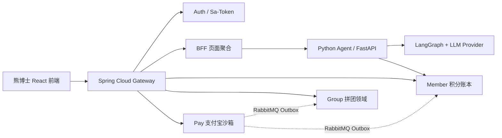

# 熊博士：拼团积分驱动的 AI 深度调研平台

熊博士是用于秋招展示的全栈微服务项目：Java 负责高并发边界和交易一致性，Python 负责 LangGraph Agent 编排、证据链和 Token 计费。浏览器只访问 Gateway，不直接暴露 Agent。



## 目录

| 目录 | 责任 |
|---|---|
| `gateway-service` | 路由、Sa-Token 校验、限流、请求/身份签名 |
| `auth-service` | 用户、角色、登录会话、注册与退出 |
| `bff-service` | 页面 DTO 聚合与 Agent SSE 透传 |
| `member-service` | 积分账户、冻结/确认/释放、不可变账本 |
| `group-service` | 拼团活动、库存、阶梯折扣、成团与退款事件 |
| `pay-service` | 现金订单、支付宝沙箱、回调、退款和补偿 |
| `agent-service` | Python + FastAPI + LangGraph、证据、报告、Token 计费 |
| `frontend` | 熊博士 React + TypeScript 工作台、拼团、支付和管理员页面 |
| `ai-group-common` | Java 共享安全头、统一响应和基础配置 |
| `contracts` | OpenAPI 与事件 JSON Schema 唯一合同来源 |
| `dev-ops` | Docker Compose、数据库初始化、消息中间件和可观测性配置 |
| `docs` | 架构、数据库、运行手册和面试材料 |
| `eval` | 面向 Gateway 的黑盒验收与回归入口 |
| `scripts` | 合同校验、演示数据和产物清理脚本 |

## 本地启动

1. 复制 `.env.example` 为 `.env`，至少修改 `AI_GROUP_INTERNAL_TOKEN`、`AI_GROUP_IDENTITY_SIGNING_SECRET` 和 Agent 的 LLM Key。
2. 启动完整环境：

```powershell
docker compose --env-file .env -f dev-ops/compose/docker-compose.full.yml up --build
```

3. 打开 <http://localhost:5173>。Gateway 地址为 <http://localhost:8080>，RabbitMQ 管理台为 <http://localhost:15672>。

没有 Docker 时，可以分别启动 Java 服务、`agent-service` 和 `frontend`；开发 Compose 只启动 MySQL、Redis、RabbitMQ、Postgres、Agent 和 Vite：

```powershell
docker compose --env-file .env -f dev-ops/compose/docker-compose.dev.yml up
```

## 验证

```powershell
mvn test
cd agent-service; python -m pytest -q; cd ..
cd frontend; npm ci; npm run lint; npm run build; cd ..
powershell -ExecutionPolicy Bypass -File scripts/validate-contracts.ps1
powershell -ExecutionPolicy Bypass -File eval/http-smoke.ps1
```

`pytest` 的 API 场景会使用 Agent Compose 提供的 Postgres checkpoint；只跑离线单元测试时可执行：

```powershell
cd agent-service
$env:PYTHONPATH = "app"
python -m pytest -q app/tests/test_billing.py app/tests/test_contracts.py app/tests/test_event_bus.py app/tests/test_llm_providers.py app/tests/test_llm_routing.py app/tests/test_agent_outputs.py
cd ..
```

`test_run_metrics.py` 和完整 API 场景需要运行中的 Postgres checkpoint，随 Docker Compose 一起执行；离线单元测试不连接外部数据库或 LLM。

Agent 的计费链路是：创建 Run → Member 冻结积分 → LangGraph 记录每次 LLM Token → 按价格版本计算实际积分 → Member 确认并释放剩余冻结。浏览器 Cookie 为 HttpOnly，Python 只接受 Gateway 生成的短期 HMAC 身份信封。

> 参考项目的工作台与 Agent 思路已重构进本仓库，不保留第二份源码副本。若项目公开或商用，应先确认参考项目许可证和作者授权。
