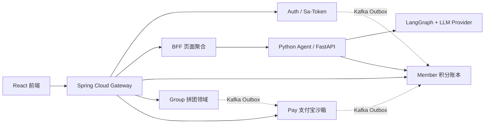

# ai-group：拼团积分驱动的 AI 深度调研平台

## 项目简介

ai-group 是一套全栈微服务平台：用户通过拼团购买积分，再用积分驱动 AI 深度调研 Agent。Java 侧负责身份、高并发拼团、现金支付与积分账本；Python 侧负责 LangGraph 研究编排、证据链、报告产出与 Token 计费。浏览器只访问 Gateway，不直接暴露 Agent。前端产品品牌仍是熊博士，工程与文档一律称 ai-group。

平台提供拼团活动配置、库存抢占、成团结算、支付宝沙箱支付、Member 两阶段额度（冻结/确认/释放）、Agent Run/SSE 事件与 LLM Token 精确结算等能力，适合作为「交易一致性 + Agent 编排」一体化工程实践。

## 系统架构

### 架构特点

- **微服务架构**：Gateway / Auth / BFF / Member / Group / Pay / Agent / Frontend 独立部署
- **双栈分工**：Java 处理交易边界与一致性；Python 处理 LangGraph 与模型调用
- **DDD 设计**：Group / Pay 沿用领域分层（api / domain / infrastructure / trigger / app）
- **最终一致性**：本地消息表（Outbox）+ Kafka + 定时补偿
- **身份边界**：Sa-Token 管浏览器会话；Gateway 验完后签发 60 秒 HS256 内部 JWT。用户 API（含 Group 查询/锁单、Pay 下单）验 JWT，不以 body / `X-User-Id` 当身份；支付宝回调和补偿 Job 只认内部令牌，userId 来自已落库订单。JWT 不是用户登录态，浏览器拿不到。

### 核心领域

- **身份与入口（Auth / Gateway / BFF）**：登录会话、路由鉴权、页面 DTO 聚合、Agent SSE 透传
- **拼团域（Group）**：活动配置、规则试算、库存抢占、成团结算、退款与通知任务
- **支付域（Pay）**：现金订单、支付宝沙箱回调、退款与 Outbox 事件
- **积分域（Member）**：积分账户唯一权威；冻结 / 确认 / 释放幂等账本
- **研究域（Agent）**：LangGraph 编排、证据与报告、LLM Provider 路由、Token 计费

### 请求链路



### 模块结构

```
ai-group/
├── gateway-service/           # 路由、Sa-Token 校验、内部 JWT 签发
├── auth-service/              # 用户、角色、登录会话、注册与退出
├── bff-service/               # 页面 DTO 聚合与 Agent SSE 透传
├── member-service/            # 积分账户、冻结/确认/释放、不可变账本
├── group-service/             # 拼团 DDD 服务（活动/标签/交易）
│   ├── group-service-api/
│   ├── group-service-app/
│   ├── group-service-domain/
│   ├── group-service-infrastructure/
│   ├── group-service-trigger/
│   └── group-service-types/
├── pay-service/               # 支付 DDD 服务（订单/回调/退款/Outbox）
│   ├── pay-service-api/
│   ├── pay-service-app/
│   ├── pay-service-domain/
│   ├── pay-service-infrastructure/
│   ├── pay-service-trigger/
│   └── pay-service-types/
├── agent-service/             # Python FastAPI + LangGraph Agent
│   └── app/                   # router / agents / service / models / alembic
├── frontend/                  # React + TypeScript + Vite 工作台
├── ai-group-common/           # Java 共享安全头、统一响应与基础配置
├── dev-ops/                   # Docker Compose、数据库初始化、中间件
├── eval/                      # Gateway 黑盒冒烟与回归入口
└── scripts/                   # 演示数据、产物清理
```

## 核心功能

### 1. 拼团活动与高并发交易

- **活动配置**：拼团活动、营销折扣、库存与限购
- **规则试算**：活动有效性、人群与优惠策略组合过滤
- **Redis 占库存 + MySQL `lock_count` CAS**：开团不走 Redis。加入先 `INCR+1` 对照活动 target 和 recovery，再 `SET NX` 兜底；同一请求里同步写 `lock_count` 和明细。落库失败或未成团退款给 recovery +1。权威闸门仍是 MySQL CAS，打满返回 `E0005`
- **成团结算与退款**：本地消息表 + MQ / 定时任务保证最终一致性

### 2. 现金支付与权益发放

- **支付宝沙箱**：下单、回调、退款链路
- **Outbox 事件**：直购在回调事务里写 Outbox 再发权益；拼团在回调线程同步 Feign 通知 Group 结算，丢了靠 `settlement_notified` 补偿，成团后再走 Outbox 发额度
- **可关闭沙箱**：本地可用模拟回调完成联调

### 3. Member 积分账本

- **两阶段额度**：创建 Agent Run 时冻结，结束后按实际 Token 确认并释放余量
- **幂等结算**：`requestId` / 冻结号关联，流水只追加不更新
- **微单位计价**：金额、Token 费用与积分使用整数微单位，避免浮点误差

### 4. AI 深度调研 Agent

- **LangGraph 编排**：规划 / 研究 / 写作 / QA 等节点与 checkpoint
- **多 Provider 路由**：OpenAI 兼容接口，支持 doubao / openai / qwen 等配置
- **证据与报告**：检索、证据链与结构化产出；SSE 推送运行进度
- **Token 计费**：按模型返回的输入 / 输出 Token 精确结算，不按 1K 向上取整

### 5. 身份与页面聚合

- **HttpOnly Cookie + Sa-Token**：浏览器会话不落 Agent，可在 Redis 撤销
- **HS256 内部 JWT**：Gateway 校验会话后签发约 60 秒内部身份；Python 用 PyJWT 验签，不接 Sa-Token
- **BFF 聚合**：前端只调 Gateway；Agent 地址不写入前端环境变量；BFF 原样转发 JWT，不重造 userId

## 技术栈

### Java 后端

- **语言 / 运行时**：JDK 21
- **框架**：Spring Boot 3.5、Spring Cloud 2025、Spring Cloud Alibaba
- **网关 / 会话**：Spring Cloud Gateway、Sa-Token
- **ORM**：MyBatis-Plus
- **数据库**：MySQL 8.0+
- **内部调用**：OpenFeign + Nacos；BFF 调 Agent 用 WebClient
- **缓存 / 锁**：Redis（会话、拼团占库存 / recovery、拼团侧固定窗口限流、短缓存）
- **消息队列**：Kafka（Outbox 投递；手动 ack + DefaultErrorHandler 有限重试，耗尽进 `{topic}.DLT`；各业务服务有 DLT 回放，失败打 `kafka.dlt.exhausted` 后 ack，不再投 `*.DLT.DLT`）
- **任务调度**：XXL-JOB 3.4.2（Admin + auth/pay/group/member 执行器；本地 Compose 已内置）
- **服务发现**：Nacos
- **构建**：Maven

### Python Agent

- **语言**：Python 3.11+
- **Web**：FastAPI、Uvicorn、Pydantic v2
- **编排**：LangGraph、langchain-core、Postgres Checkpoint
- **持久化**：SQLAlchemy（asyncio）、asyncpg、Alembic、PostgreSQL
- **LLM / 检索**：OpenAI 兼容 SDK、Tavily 等工具链
- **服务发现**：nacos-sdk-python（注册为 `agent-service`，BFF 按服务名发现）
- **可观测**：structlog
- **测试**：pytest、pytest-asyncio

### 前端

- **框架**：React 18、TypeScript、Vite
- **路由 / 数据**：React Router、TanStack Query、Axios
- **样式**：Tailwind CSS
- **可视化**：React Flow（Agent 运行图等）

### 工程与运维

- **容器**：Docker Compose（`dev-ops/compose/`）
- **日志**：Logback（Java）、structlog（Python）

## 技术亮点

### 1. Java + Python 边界清晰

交易、支付、积分与身份留在 Java；模型 SDK、异步研究与图编排留在 Python。两边通过各服务 DTO / Feign / Pydantic 与 HS256 内部 JWT 协作，不共享数据库或 SDK。

### 2. DDD 拼团 / 支付领域落地

Group / Pay 采用 api、domain、infrastructure、trigger、app 分层，用聚合与领域服务承载锁单、结算、退款等复杂流程，保持高内聚、低耦合。

### 3. 分布式事务最终一致性

支付与拼团结算落地本地消息任务，异步投递 MQ；定时任务 + 分布式锁做多实例幂等抢占与失败重试，保证支付成功、成团通知与积分发放可靠触达。

### 4. 积分驱动的 Agent 计费闭环

创建 Run 时一笔冻结（`requestId=agent:{run_id}`）→ LangGraph 累计每次 LLM 的 Token 与价格版本 → 终态按费率 confirm 并释放剩余冻结。额度权威在 Member，Agent 只消费额度契约。

### 5. 可恢复的 Agent 运行面

Run / Event 持久化，SSE 支持断线后按事件游标回放；LangGraph Checkpoint 落 Postgres，避免把运行状态绑死在浏览器长连接上。

### 6. 冒烟门禁

`eval/http-smoke.ps1` 做 Gateway 黑盒冒烟。跨服务字段以 Pay `TradeCompletedEvent`、Auth Outbox JSON、Member/BFF DTO 为准。

## 环境要求

- **JDK**：21+
- **Maven**：3.9+
- **Python**：3.11+
- **Node.js**：18+（前端）
- **MySQL**：8.0+
- **PostgreSQL**：14+（Agent Checkpoint / 运行数据）
- **Redis**：5.0+
- **Kafka**：3.8+（KRaft）
- **Nacos**：2.x（Compose 内可一键拉起）
- **Docker / Docker Compose**（推荐全栈启动）

## 快速开始

### 1. 环境准备

复制环境变量模板并填写密钥：

```powershell
Copy-Item .env.example .env
```

至少修改：

- `AI_GROUP_INTERNAL_TOKEN`
- `AI_GROUP_IDENTITY_SIGNING_SECRET`
- Agent 的 LLM Key（如 `OPENAI_API_KEY`）

### 2. 一键启动全栈（推荐）

```powershell
docker compose --env-file .env -f dev-ops/compose/docker-compose.full.yml up --build
```

启动后访问：

- 前端：<http://localhost:5173>
- Gateway：<http://localhost:8080>
- Kafka：<http://localhost:9092>
- XXL-JOB Admin：<http://localhost:18081/xxl-job-admin>（默认账号 `admin` / `123456`）

### 3. 仅启动依赖（本地分别跑服务）

```powershell
docker compose --env-file .env -f dev-ops/compose/docker-compose.dev.yml up
```

该模式通常只拉起 MySQL、Redis、Kafka、Postgres、Agent 与 Vite 等开发依赖，Java 服务可本地 `mvn` 启动。

### 4. 编译 Java 模块

```powershell
mvn clean install -DskipTests
```

### 5. 单独启动 Agent / 前端

```powershell
# Agent
cd agent-service
python -m pip install -r app/requirements.txt
$env:PYTHONPATH = "app"
alembic -c app/alembic.ini upgrade head
uvicorn main:app --host 0.0.0.0 --port 8090

# Frontend
cd frontend
npm ci
npm run dev
```

## 项目结构说明

### Gateway / Auth / BFF

- **gateway-service**：统一入口、鉴权、HS256 内部 JWT 签发（限流在拼团侧 Redis，不在网关）
- **auth-service**：账号体系与 Sa-Token 会话
- **bff-service**：页面级聚合与 Agent SSE 代理（浏览器永不直连 Agent；`ai-group.agent.url` 空则 `lb://agent-service`，local 直连）

### Member

积分账户唯一权威。对外提供冻结 / 确认 / 释放接口，流水只追加；Agent 计费以此为结算终点。

### Group / Pay（DDD）

- **api**：对外接口与 DTO
- **domain**：活动、交易、退款等核心业务
- **infrastructure**：持久化与外部适配
- **trigger**：HTTP、MQ 监听与定时任务
- **app**：Spring Boot 启动与应用编排

### Agent（Python）

- **router**：FastAPI 入站协议与 SSE
- **agents**：LangGraph 状态、节点与子图
- **service**：Run、事件总线、LLM 路由、计费、证据与关注列表
- **models / alembic**：Postgres Schema 与迁移
- **security**：Gateway HS256 内部 JWT 校验
- **发现**：Compose 下注册 Nacos（`agent-service`）；失败只打日志，不把进程打死

### frontend / dev-ops

- **frontend**：研究工作台、拼团、支付与管理页
- **dev-ops**：Compose、库表初始化与中间件配置

## 部署说明

### Docker 部署

仓库提供完整 Compose 方案：

- `dev-ops/compose/docker-compose.full.yml`：全栈（中间件 + Java + Agent + Web）
- `dev-ops/compose/docker-compose.dev.yml`：开发依赖为主

数据库初始化脚本与中间件配置位于 `dev-ops/`。

### 生产环境建议

- 轮换并妥善保管 `AI_GROUP_INTERNAL_TOKEN`、`AI_GROUP_IDENTITY_SIGNING_SECRET` 与 LLM / 支付密钥
- 身份三层：Sa-Token 浏览器会话（可撤销）/ Gateway HS256 内部 JWT（约 60s，不是登录态）/ `X-Internal-Token` 服务凭证
- 已知边界：内部 JWT 不存 nonce 黑名单；密钥为对称共享；回调/Job 没有用户 JWT，只认内部令牌 + 订单里的 userId
- 限流在 Group 的 Redis，网关没有落地 `RequestRateLimiter`
- 观测栈（ELK 等）在 `dev-ops/observability`，不是启动依赖
- Group / Pay 的 Java 包名和库名有历史保留（`com.aigroup.paymall`、`group_buy_market`、`s_pay_mall_ddd_market`），运行时服务名以本文模块结构为准
- JVM 按机器规格设置堆与 GC（例如 G1）
- MySQL / Redis / Kafka / Postgres 开启持久化与高可用
- Agent 与 Member 之间网络隔离，禁止浏览器直连 Agent

## 验证

```powershell
mvn test
cd agent-service; python -m pytest -q; cd ..
cd frontend; npm ci; npm run lint; npm run build; cd ..
powershell -ExecutionPolicy Bypass -File eval/http-smoke.ps1
```

离线 Agent 单元测试示例（不连外部库或 LLM）：

```powershell
cd agent-service
$env:PYTHONPATH = "app"
python -m pytest -q app/tests/test_billing.py app/tests/test_contracts.py app/tests/test_event_bus.py app/tests/test_llm_providers.py app/tests/test_llm_routing.py app/tests/test_agent_outputs.py
cd ..
```

完整 API 场景与 `test_run_metrics.py` 依赖运行中的 Postgres Checkpoint，建议随 Docker Compose 一起执行。

## 开发规范

- Java 遵循 Spring Boot / 分层模块既有约定；优先构造器注入与明确 DTO 命名
- Agent 使用 Python 3.11+、Ruff / pytest；包边界见 `agent-service/app`
- 前端提交前执行 `npm run lint` / `npm run build`
- 不绕过 Gateway 身份头与内部 Token 校验
- 密钥只放 `.env`，`.env.example` 仅保留安全默认占位

---

Group / Pay 的领域分层沿用既有拼团与支付工程结构；包名、库名未做运行时重命名。对外品牌、身份口径和计费口径以本文及各服务 README 为准。
