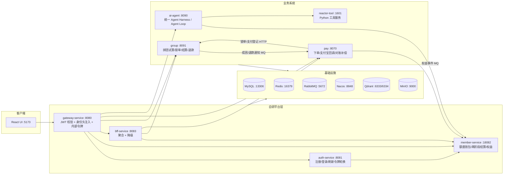

# AI-Group：网页 Agent + 拼团支付一体化平台

一个面向 C 端的「AI 网页 Agent」学习项目：用户注册后获得月度免费额度，也可通过**拼团**购买额度包；支付成团后，订单快照中的基础额度与阶梯加赠额度经 MQ 幂等入账，再用于统一 Agent Loop 流式对话。项目聚合微服务平台、拼团、支付与自研 Agent Harness，覆盖鉴权、额度结算、工具执行、run-local Todo evidence、完成门禁、执行账本、历史回放，以及 ChatGPT Work 风格的项目工作区与任务图看板。

> 技术基线：JDK 21、Spring Boot 3.5.16、Spring Cloud 2025.0.3、Spring Cloud Alibaba 2025.0.0.0、Spring AI 1.1.x、React 19 + Vite 6。

---

## 1. 架构总览



数据流（主链路）：注册 → 登录 → 初始化 5 credits 免费额度 → 额度包下单 → 支付/成团结算 → 权益事件（outbox + MQ）→ member 按订单快照发放付费额度 → Agent 的每次 LLM 调用先预留上界；成功调用按 provider usage（缺失时使用有界本地估算）结算，失败且没有真实 usage 或输出证据时释放整笔预留。

边界上，Agent Loop 只负责 AI 任务的模型—工具—验收循环，不接管支付、拼团或额度状态机。涉及资金、名额和权益的流程继续由确定性的领域规则、数据库事务、幂等键与 outbox 驱动；两部分只通过受控 HTTP/MQ 契约和 `QuotaBillingPort` 集成，避免让 LLM 决策进入资金链路。

## 2. 模块职责

各模块的详细说明见对应目录下的 README。

| 模块 | 端口 | 包名 / 技术 | 职责 |
|------|------|------|------|
| [`gateway-service`](gateway-service/README.md) | 8080 | `com.aigroup.gateway` / Spring Cloud Gateway (WebFlux) | 统一 JWT 校验、身份头注入与下游剥离、内部回调令牌校验、CORS |
| [`auth-service`](auth-service/README.md) | 8081 | `com.aigroup.auth` / JJWT + BCrypt | 注册/登录/登出/刷新（Redis 刷新令牌原子轮换 + 访问令牌黑名单） |
| [`member-service`](member-service/README.md) | 18082 | `com.aigroup.member` / MyBatis-Plus | 额度包 SKU、免费/付费额度账户、`freeze→confirm/release` 两阶段结算、按订单幂等发放、人工审核式撤销、月度免费额度重置、DLQ |
| [`bff-service`](bff-service/README.md) | 8083 | `com.aigroup.bff` / OpenFeign | 聚合 member/group/pay，带降级（degrade）元信息 |
| [`ai-group-common`](ai-group-common/README.md) | - | `com.aigroup.common` | JWT 工具、内部令牌属性、统一 Result/异常、身份头过滤器 |
| [`group`](group/README.md) | 8091 | `com.aigroup.groupbuy` / DDD 六模块 | 拼团试算责任链、四类折扣计算器、锁单/结算/退款规则链、超时补偿、本地消息表 |
| [`s-pay-mall-ddd-market`](s-pay-mall-ddd-market/README.md) | 8070 | `com.aigroup.paymall` / DDD 六模块 | 下单/掉单恢复、支付宝沙箱回调（验签+金额+幂等）、拼团锁单结算、退款、对账补偿 Job |
| [`ai-agent`](ai-agent/README.md) | 8090 | `com.linrun.agent` / Spring AI | 可审计 Agent Harness + Work 控制面：统一 Agent Loop、Todo evidence、项目工作区、任务依赖看板、账本回放与配额计费 |
| `ai-agent/reactor-tool` | 1601 | Python (uv) | deep_search / web_fetch / 图片生成 / 脚本沙箱 / embedding 等工具 |
| `ai-agent/ui` | 5173 | React 19 + Vite + antd | 聊天/定价/订单前端，SSE 流式消费 |

## 3. 快速开始

### 前置依赖

- **Docker Desktop**（基础设施）
- **JDK 21** + **Maven 3.8.8+**（本次验收使用 3.8.8）
- **Node 20+** + **pnpm**（锁定的 Vitest 4 要求 Node 20 及以上）
- **PowerShell 7.4+（`pwsh`）** — 启动脚本使用 `Start-Process -Environment` 安全传递服务变量，**Windows 自带的 5.1 会解析报错**
- **Python 3.11+ + uv** — 推荐的一键启动会启动 reactor-tool，因此完整链路必需；仅单独运行 Java 平台时可不安装
- 一个 DashScope（阿里百炼，兼容 OpenAI 协议）API Key

### 一键启动（推荐）

```powershell
# 1. 复制环境变量模板并填入真实 Key
Copy-Item .env.example .env
# 编辑 .env，至少填入 AGENT_GROUP_LLM_API_KEY / DASHSCOPE_API_KEY

# 2. 用 PowerShell 7 一键起：Docker 基础设施 + DB 初始化 + 构建 + 7 个服务 + 前端 + 冒烟
pwsh -NoProfile -ExecutionPolicy Bypass -File docs/dev-ops/start-full-stack.ps1

# 默认 member 使用 18082，避免与 ai-interview 的 8082 重叠；仍可显式改成其他空闲端口
pwsh -NoProfile -ExecutionPolicy Bypass -File docs/dev-ops/start-full-stack.ps1 -MemberPort 19082

# 可选：需要 Prometheus/Grafana/ELK 等观测组件时显式开启（额外占用较多内存）
pwsh -NoProfile -ExecutionPolicy Bypass -File docs/dev-ops/start-full-stack.ps1 -IncludeObservability
```

默认只启动 MySQL、Redis、RabbitMQ、Nacos、Qdrant、MinIO 等业务必需基础设施；观测栈不会默认占用本机资源。启动完成后：前端 http://localhost:5173/login ，网关 http://localhost:8080 。

### 手动启动

> 以下命令用于**已经至少成功执行过一次 `start-full-stack.ps1` 完成全量建表与 seed** 后的分服务调试。单独执行 Docker Compose 只创建数据库，不会递归执行各子目录迁移，不能替代首次一键初始化。

```powershell
$ErrorActionPreference = 'Stop'

# 基础设施
Set-Location '.\docs\dev-ops'
docker compose --env-file '..\..\.env' -f 'docker-compose-platform.yml' up -d

# 回到仓库根目录后构建
Set-Location '..\..'
mvn clean install -DskipTests
Push-Location '.\group'
mvn clean install -DskipTests
Pop-Location
Push-Location '.\s-pay-mall-ddd-market'
mvn clean install -DskipTests
Pop-Location
Push-Location '.\ai-agent'
mvn clean install -DskipTests
Pop-Location

# 按端口表启动后端服务；前端单独启动
Set-Location '.\ai-agent\ui'
pnpm install --frozen-lockfile
pnpm dev
```

## 4. 端口清单

| 类别 | 服务 | 端口 |
|------|------|------|
| 平台 | gateway / auth / member / bff | 8080 / 8081 / 18082 / 8083 |
| 业务 | pay / agent / group / reactor-tool | 8070 / 8090 / 8091 / 1601 |
| 前端 | Vite dev server | 5173 |
| 基础设施 | MySQL / Redis / RabbitMQ | 13306 / 16379 / 5672(15672) |
| 基础设施 | Nacos / Qdrant / MinIO | 8848 / 6333(6334) / 9000(9001) |

## 5. 验证脚本

```powershell
# 平台冒烟：注册→登录→定价→5,000,000 microcredits 免费额度
pwsh docs/dev-ops/smoke-test.ps1
# 权益链路：模拟成团 MQ → 发放 60 credits 付费额度
pwsh docs/dev-ops/smoke-benefit-event.ps1
# 已发放权益撤销：记录 REJECTED_GRANTED，不静默扣回
pwsh docs/dev-ops/smoke-benefit-revoke.ps1
# 端到端：双账号注册→开团/参团→分别支付→显式封团→双方权益到账
pwsh docs/dev-ops/verify-e2e.ps1
# 安全冒烟：直连/伪造头/无令牌回调均应被拒
pwsh docs/dev-ops/smoke-security.ps1
# 真实模型 Agent Loop SSE：校验流式帧、最终帧和额度结算
pwsh docs/dev-ops/smoke-agent-sse.ps1
# Provider 凭据失败：校验 MODEL_ERROR、冻结释放且不扣额度
pwsh docs/dev-ops/smoke-agent-sse.ps1 -ExpectedOutcome MODEL_FAILURE_NO_CHARGE
# DEEP Agent Loop：校验 todo/tool/verification/run_finished canonical 生命周期
pwsh docs/dev-ops/smoke-agent-sse.ps1 -ExecutionMode DEEP -OutputStyle text `
  -Query '不要调用外部工具。请用三点解释 Agent 为什么需要完成门禁。'
```

2026-07-18 本地验证快照：Agent `508/508`、前端 `192/192`、支付 `84/84`、拼团 `24/24`，
Python 工具 `148 passed, 1 skipped, 3 subtests passed`；前端 ESLint 与生产构建通过。真实浏览器使用有效 `qwen-plus`
完成两个隔离账号注册：账号 A 开团并支付后队伍保持开放，账号 B 加入同一队伍并支付，显式封团后
双方各到账 60 点永久额度；随后 DEEP Agent Loop 以 `todo_write + code_interpreter + CompletionGate`
计算并验证平方和，页面显示 2/2 Todo、工具证据、成功终态、Token 与耗时。

## 6. 技术亮点

- **执行账本 + durable request claim + 历史回放**：`dialogue_run.request_id` 唯一键原子认领一次运行，只有 `NEW` 请求可进入模型与工具；运行中的重复请求返回可重试终态，已结束请求直接回放，不重复计费或执行副作用。工具账本分别保存面向 UI 的 `tool_result` 与面向模型的 `llm_observation`，避免结构化工具在历史回放时退化为不可解析文本。`dialogue_run / llm_invocation / tool_invocation / artifact_record` 仍是事实账本/投影机制，不宣称完整 Event Sourcing、断点续跑或 exactly-once。
- **上下文工程与三层记忆**：所有对话统一进入 Agent Loop，由 `ContextPipeline` 与 `ContextManager` 同时预算 system prompt、消息、记忆、工具 schema 与安全余量，working context 保留完整 tool-call 原子单元，并注入会话摘要/长期记忆块。长期记忆仅准入用户明确声明的 `PREFERENCE / FACT / PROCEDURE`，普通问答不自动写入，并支持 owner、source、confidence、version、TTL 与稳定语义槽位 upsert；开发环境默认启用 Qdrant 跨会话层，首次保存按真实 embedding 维度建集合并创建 owner 等 keyword 索引。
- **MCP 动态工具生态**：MCP Registry 支持 SSE、STDIO、Streamable HTTP 的工具发现与调用；开发 seed 预置两个官方 FastMCP 只读 Server、4 个 `project_` / `utility_` 工具，并以 Python 与 Java 互操作测试真实覆盖 `initialize -> tools/list -> tools/call`。当前只消费 MCP Tools，不把它表述为完整实现全部 MCP 能力。
- **循环与工具治理**：`StopGate`、重复轮次检测和 turns/tool calls/completion attempts/time/Token/microcredits 复合预算提供类型化终止；工具失败有界重试并结构化回喂。SSE 断开后在执行边界停止后续步骤，已发生的 LLM 调用仍按实际/估算 usage 结算；另有 per-user 并发限流和 durable settlement command 恢复任务，`ai-agent` 托管冻结不会被 member 按超时误释放。
- **可复现 Agent Eval**：离线固定集输出 `pass@k`、`pass^k`、memory precision/recall 与估算 token cost；Resume benchmark 在相同 12K token 预算下比较硬截断和滚动摘要。README 指标只代表确定性离线样本，不冒充线上成功率。
- **Todo evidence 与完成门禁**：DEEP 步骤声明 `NONE / TOOL` policy，并通过独立 `activationId`、当前步骤真实工具证据和单次消费约束阻止跨步骤复用；`LEGACY` 只用于历史兼容。`EvidenceValidator + CompletionGate + FinalVerifier` 与 canonical `run_finished` 共同阻止未完成任务被误报为成功；最终 JAR 已用本地 OpenAI-compatible SSE stub 真实跑通 `read_tool -> verification_result(passed) -> run_finished(SUCCESS)`，execution ledger 与历史回放不是 durable checkpoint/resume。
- **工具执行安全边界**：`reactor-tool` 默认只监听回环地址，写操作要求内部服务令牌；脚本运行限制解释器、并发、时间、输出、文件、环境变量与 POSIX 资源，并提供 non-root/read-only 容器配置。
- **Claude-skills 风格技能系统**：`SKILL.md` 解析 + 路径沙箱 + `read/grep/glob/list/skill/script_runner` 工具族。
- **调用级配额结算**：每次 LLM 调用按输入估算与最大输出预扣；成功调用按 provider usage（缺失或 `0/0` 时回退有界本地估算）确认实际消耗并释放余量，失败调用只有观察到 provider usage 或真实部分输出才结算，否则整笔 release。生图、DeepSearch 等固定附加费只在远端成功且非 fallback 时确认。Agent 以 durable settlement command、稳定 requestId 和冻结终态查询恢复不确定响应；member 负责账户原子性与幂等，不会超时释放 `ai-agent` 托管冻结。执行账本用于审计，不参与 run 级统一扣费。
- **支付一致性**：支付宝回调「验签 + 金额比对 + 订单存在性 + SQL 状态守卫」四件套；超时关单前先对账支付宝；本地消息表（outbox）+ 补偿 Job 保证权益/结算最终一致。
- **拼团超卖防护**：Redis 预占 + DB 条件更新（CAS）+ 唯一索引三层。
- **网关安全**：JWT 校验 + 身份头剥离/注入、刷新令牌 `getAndDelete` 原子轮换、内部回调令牌校验。

## 7. 设计取舍

- 保留自研 Agent Harness，不迁移 Spring AI Alibaba Runtime：统一 Agent Loop、Todo evidence、CompletionGate、执行账本与 SSE 回放更贴合本项目的可审计边界。
- [浏览器双账号交易与 Agent 验收记录（2026-07-18）](docs/browser-acceptance-2026-07-18.md)
- [历史浏览器验收记录（2026-07-17）](docs/browser-acceptance-2026-07-17.md)

## 8. 目录结构

```
ai-group/
├── ai-group-common/        # 平台共享库
├── gateway-service/        # API 网关
├── auth-service/           # 认证
├── member-service/         # 免费/付费额度钱包与权益
├── bff-service/            # BFF 聚合
├── group/                  # 拼团（DDD 六模块，com.aigroup.groupbuy）
├── s-pay-mall-ddd-market/  # 支付（DDD 六模块，com.aigroup.paymall）
├── ai-agent/               # Agent 运行时 + reactor-tool + ui（com.linrun.agent）
└── docs/dev-ops/           # 启动脚本、docker-compose、SQL 初始化、冒烟脚本
```
