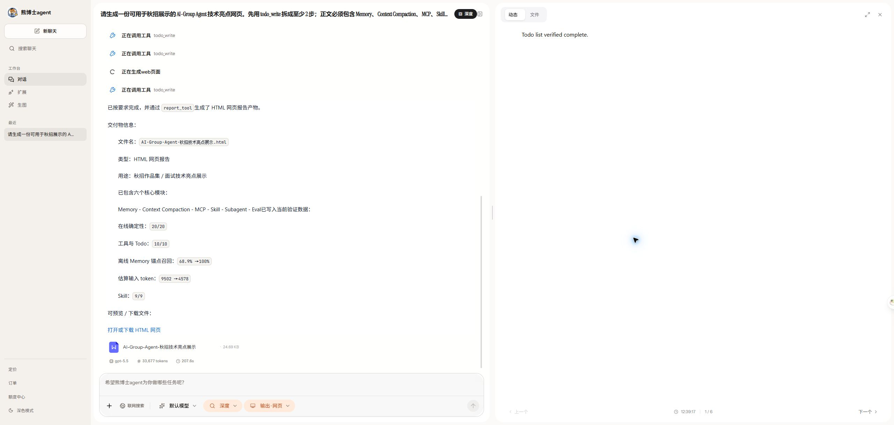
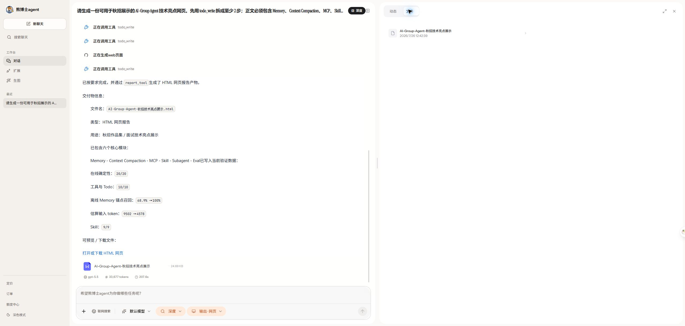
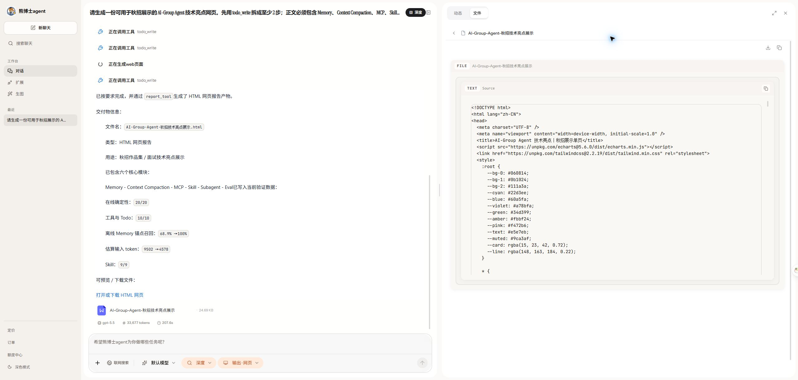
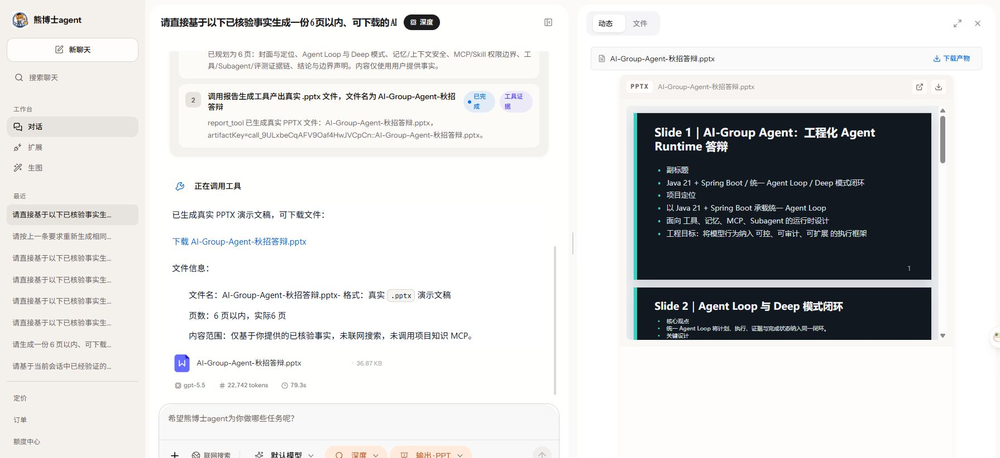
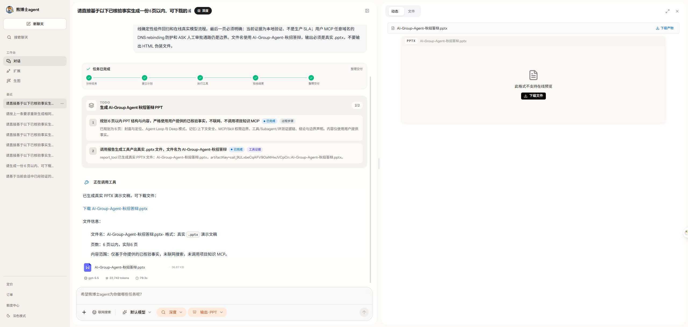
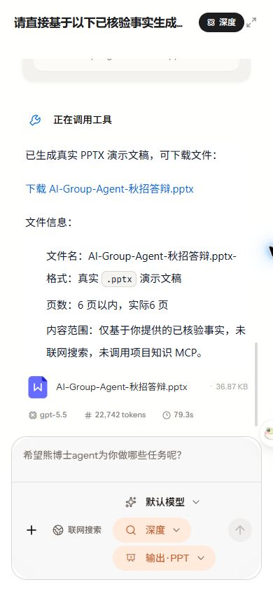
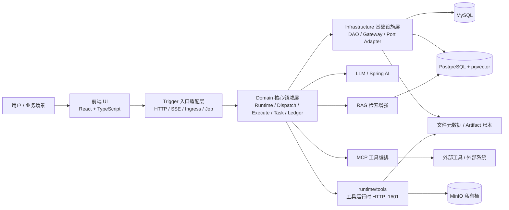
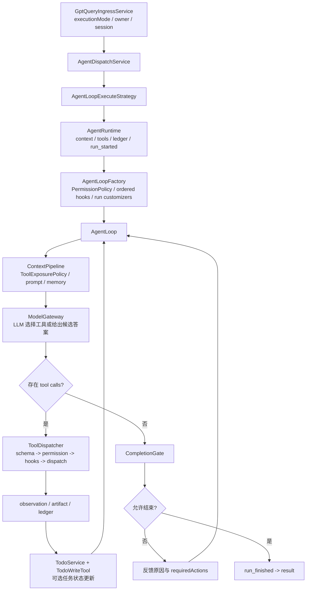

# AI Agent 运行时 (AI Agent Runtime)

## 项目简介

`ai-agent` 是面向复杂任务自动化的**可审计 Agent 应用运行时**（挂在 AI-Group：**拼团获额与按量计费 Agent 平台**）。
它不是「单轮对话 + 调一次工具」的 Demo，而是把 **统一 Agent Loop**、工具编排、Todo 证据、完成门禁、执行账本、会话记忆、MCP/Skills 串成一条可运行、可追踪、可回放的链路。

主循环：`AgentRuntime` 创建单次 run → `AgentLoopFactory` 组装独立 `AgentLoop / HookBus` → `ContextPipeline + ModelGateway` 调模型 → 工具执行写 observation/artifact → `TodoService` 推进步骤 → `CompletionGate` 验收后才允许成功结束。

> 形态对齐主流 coding / 应用 Agent（Claude Code / Pi 一类）：**一条 Agent Loop**，而不是 Planner/Executor 硬拆的 Plan-Execute 双管道。
> 场景与**产物展示**参考 [OWWZO/ai-agent](https://github.com/OWWZO/ai-agent)（参考交付物，不照搬多智能体调度）；核心设计覆盖 Loop、Deep Research 并行分支、上下文/记忆、Skill·MCP、门禁、账本、评测与额度。

公开 Harness 行为参考快照（2026-07-17）：

- [shareAI-lab/learn-claude-code@a9cafe9](https://github.com/shareAI-lab/learn-claude-code/commit/a9cafe953aa714f9cb1171f217d96bd2734bbcc7)
- [claude-code-best/claude-code@b4149bb](https://github.com/claude-code-best/claude-code/commit/b4149bbf7391ad62f82734314d5c7c250c6c7b59)

不宣称 Anthropic 官方实现、分布式 durable execution、完整 HITL 权限控制面或通用 SubAgent 平台。

### 与平台的关系

额度由 `member-service` 账户 `freeze → confirm(usage) / release`；本服务通过 `QuotaBillingPort` 按次计量。
拼团/支付是独立交易域，**不是** Agent 业务场景——Agent 只消费已入账额度；同场演示仅为**额度集成**。

### 核心实现索引

| 主题 | 入口类（`ai-agent-domain`） |
|------|---------------------------|
| AgentLoop | `runtime/agent/AgentLoop.java` |
| 多 Agent（限定于 DEEP） | `runtime/deepresearch/DeepResearchGraphRunner.java`、`AgentContext#forkForParallelTask` |
| 上下文压缩 | `runtime/context/ContextManager.java`、`ContextTrustBoundary.java`、`ContextBudget.java`（顺序：trust normalize → observation compact → tool schema/安全余量扣减 → fitToBudget） |
| 记忆 | `memory/SessionContextMemoryService.java`、`memory/LongTermMemoryServiceImpl.java` |
| Skill | `runtime/tool/skill/DefaultSkillRegistry.java` |
| MCP | `runtime/tool/mcp/runtime/McpRegistry.java`、`runtime/tool/exposure/ToolExposurePolicy.java` |
| 工具/Todo | `runtime/tool/factory/AgentToolCollectionFactory.java`、Todo + CompletionGate |
| 评测 | 仓库 `docs/evals/`（`run-evals.ps1` / `run-offline-benchmarks.ps1`） |

多 Agent：普通请求使用一个 run-local `AgentLoop`；只有 DEEP 研究图会并行执行研究分支，再统一合并、审阅并生成报告。目前没有通用 `spawn_subagent` 工具。

### Work 看板（可选演示）

`/api/agent/work` + 前端四列看板：`TodoService` 仍是 run-local；`TaskGraphService` 管跨会话工作项依赖。不等于 Loop checkpoint/resume。

## 解决的痛点

| 痛点 | 本项目做法 |
|------|------------|
| 单轮对话撑不起多步任务 | 统一 Agent Loop + run-local Todo |
| 模型嘴上说做完了 | CompletionGate：证据/产物/Todo 未齐不得 SUCCESS |
| 工具结果难沉淀、难复用 | artifact + 执行账本，可回放 |
| 上下文与工具 schema 膨胀 | 常驻 / 条件 / 延迟工具分层暴露 |
| Demo 难计费、难追责 | 调用级额度预留结算 + requestId 认领 |

## 核心执行闭环

```text
用户提出研究问题（前端选 DEEP，打开联网）
  -> Agent 建立 Todo
  -> deep_search / 文件 / RAG 收集证据
  -> 工具结果沉淀为 artifact
  -> Report 生成可预览产物
  -> CompletionGate 检查覆盖、证据和产物
  -> Deep Research 图合并、审阅，必要时最多一次定向修复
  -> 持久化报告 artifact -> run_finished(SUCCESS) -> result
```

`AUTO` 会归一化为 `STANDARD` 并进入普通 `AgentLoop`；`DEEP` 进入独立的
`DeepResearchGraphRunner`。二者共享入口、工具边界、账本和终态协议，但不是同一个执行引擎。
网页只展示阶段、Todo、工具结果、产物与验收结论。

### 工具分层

- **常驻**：Todo、文件等控制面工具
- **条件**：联网搜索、附件、用户 MCP（如 `online=true`）
- **延迟**：`tool_search + execute_extra_tool` 按需发现，避免 schema 占满上下文

## 典型应用场景

> 下表说明同一套 Loop、工具与 Skill 可以覆盖的典型业务场景；研究报告是当前实现最完整的任务闭环。

### 研究与决策

| 场景 | 怎么跑 | 用到什么 |
|------|--------|----------|
| **技术选型 / 调研报告**（主推） | 搜索多源 → Todo 取证 → 结构化报告 | DeepSearch + Report + CompletionGate |
| **竞品对比** | 搜索公开信息 → 表格/图表 → 小结 | Search + CodeInterpreter / Chart Skill |
| **开源项目评估** | 拉仓库信息 → 分析 → 报告 | GitHub Skill + Report |

### 检索与内容

| 场景 | 怎么跑 | 用到什么 |
|------|--------|----------|
| **知识库 / 手册问答** | 上传或入库 → 混合检索 → 引用回答 | MRAG + Rerank |
| **图文报告 / PPT / 海报** | 搜索素材 → 生成产物 | Report / PPT / Image Skill（按需） |

### 工程辅助

| 场景 | 怎么跑 | 用到什么 |
|------|--------|----------|
| **脚本分析 / 轻量代码执行** | 在沙箱跑分析脚本 | code_interpreter（权限受限） |

## 运行截图与交付物

下图来自 2026-07-26 本地全栈 Chrome 验收。它证明当前版本的实际交付链路，不代表线上成功率或生产 SLA。复现入口见 [开发运维说明](../docs/dev-ops/README.md)。

| 类型 | 如何得到 | 前端行为 |
|------|----------|----------|
| HTML 报告 | DEEP + 输出 HTML → `report_tool` | ActionPanel 沙箱预览 + 下载 |
| Markdown | 输出文档 → `report_tool` | Markdown 预览 + 下载 |
| PPTX | DEEP + 输出 PPT → `report_tool` / ppt-generation Skill | 在线只读预览 + 原始 `.pptx` 下载 |

### DEEP 执行与 HTML 产物







### PPTX、历史回放与移动端







### 附录：智能问数

仓库仍保留固定 NL2SQL Pipeline（Schema 召回 → NL2SQL → SELECT 限制 → JDBC），**不是** Loop 自主 Data Agent。
`POST /data/testQuery` **默认关闭**（`autobots.data-agent.test-query.enabled=false`），当前能力不等同于企业级数据分析 Agent。

## 技术栈

- 后端：Java 21、Spring Boot 3.5、Spring AI 1.1、MyBatis、OkHttp SSE
- 数据层：MySQL、PostgreSQL + pgvector、MinIO 私有对象存储
- 检索：pgvector 余弦、`pg_trgm` 关键词与 RRF 混合召回
- 前端：React 19、TypeScript、Vite、Ant Design

## 系统架构图



## 核心能力

### 1. 统一 Agent Loop

- `AgentRuntime` 负责 run-local 上下文、工具目录、账本与终态协议，`AgentLoop` 负责模型—工具循环
- `AgentLoopFactory` 是可注入的 Harness 装配边界：Spring 可提供 `PermissionPolicy`、有序 Hooks 与 `RunCustomizer`，每个 run 重新创建可变 `HookBus` 和循环实例，避免跨请求状态泄漏
- `ContextPipeline` 生成当前轮上下文和可见工具，`ModelGateway` 隔离底层 LLM，`ToolDispatcher` 统一 ID/Schema 校验、权限、Hook、执行、证据与账本
- `AUTO` 兼容归一化为 `STANDARD`，二者使用普通 `AgentLoop`；`DEEP` 切换到 `DeepResearchGraphRunner`，内部研究分支复用 run-local `AgentLoop`，两种执行引擎共享工具、账本与终态协议
- `TodoService` 是运行内唯一任务状态源，`TodoWriteTool` 只是模型适配器；每轮 system prompt 尾部注入 fresh `current_todo_state`，压缩后仍保留 completed prefix、唯一 `in_progress` 与 pending suffix，并用当前步骤驱动工具预选
- DEEP Todo 的每一步显式声明 `NONE / TOOL` evidence policy，并在进入步骤时生成独立 `activationId`：`NONE` 步骤只能通过 `todo_write` 更新，`TOOL` 步骤只能消费当前步骤、当前 activation 内新产生且尚未消费的真实工具证据；禁止跨步骤、跨 activation、重复消费 evidence，也禁止用 `ToolOperationLedger` 的 reused 结果证明新步骤。历史 Todo 缺少新字段时按 `LEGACY` 兼容回放
- `CompletionGate` 检查未完成 Todo、未解决工具失败、必需 artifact 与最终覆盖；多对象比较必须逐 `subject × dimension` 提供实质内容，拒绝时把修正动作写回同一上下文继续当前项
- `ToolInvocationContract` 将用户明确提出的“必须、只能、禁止调用某工具”解析为 run-level `required / allowed / forbidden / exclusive` 集合，并同时约束工具暴露、权限判断和最终 evidence；Harness 控制工具 `todo_write` 不会因此被误禁用
- `CompletionOutputContract` 只保守提取用户明确要求输出的两个及以上 `snake_case` 字段，最终门禁检查字段名是否出现；普通问题、单字段解释和否定句不会被擅自扩展成输出契约，它也不替代字段值、类型和业务语义校验
- MCP transport/`isError`/空结果统一为 typed failure；取消 Future 会向下 dispose 模型 Flux，模型调用、远程流工具和并发工具批次共享同一 run deadline
- `run_finished` 是权威运行终态，只有 `status=SUCCESS && completionGatePassed=true` 才表示成功；`result` 只承载最终内容与 metrics
- 历史回放合成同样的 `run_started -> run_finished -> result` 生命周期，并保留 `SUCCESS / FAILED / STOPPED / TIMEOUT`、`completionGatePassed` 与 `stopReason`

### 2. 共享工作区与工具组合执行

- 搭建工具产物登记与可见性机制，将搜索结果、分析文件、报告和图片结果统一沉淀到会话级工作区
- 支持跨工具传递、上下文续用与任务级结果串联，形成 `搜索 -> 分析 -> 报告 -> 汇总` 的**多工具组合闭环**
- 让前序工具生成的文件与中间结果可以被后续工具直接复用，避免链路割裂和重复处理

### 3. 基于安全声明的多工具调度

- 同一轮多个 `tool call` 默认串行；只有工具显式声明 `isConcurrencySafe(input)` 的连续安全调用才使用 CompletableFuture 并行
- Todo、报告、代码、文件生成和未知 MCP 等副作用/未知能力不会被自动并发；所有路径仍统一事件、artifact、证据、账本和取消语义
- `ToolOperationLedger` 在单次 run 内按“规范化工具名 + 规范化 JSON 参数”的 SHA-256 key 复用已经成功的相同调用，避免重复副作用；失败调用和参数不同的调用仍可再次执行，轮询/实时读取工具可通过 `allowRepeatedSuccessfulCall=true` 显式退出复用
- 复用只减少真实工具执行，不免除模型请求产生的 tool-call 预算计数，也不等价于跨 run 幂等、exactly-once 或 durable 去重

### 4. Skill + Todo 工作管理体系

- Skill 按需加载领域知识与受控脚本，TodoWrite 在统一 Agent Loop 内维护复杂任务的可见步骤与状态
- DEEP 模式要求 Todo、工具证据、完成门禁和最终校验一致通过，不再依赖独立 SOP 预规划服务
- 计划更新与实际执行共享同一上下文、账本和取消边界，避免 Planner / Executor 双轨状态漂移

### 5. RAG 与混合检索增强

- `AnalyzeFileTool -> DocumentIngestRouter` 统一处理文件：图片写入 VLM 描述，小文本直接返回上下文，大文本切分后写入 `file_chunk`
- 原始上传文件和报告产物写入 MinIO 私有桶，本地目录只作为工具执行缓存；缓存缺失时从 MinIO 恢复，预览和下载仍经过受控文件代理
- PostgreSQL 单表保存文件、知识、摘要和 schema，使用 pgvector 余弦、`pg_trgm` 与 RRF 去重合并
- embedding 或数据库失败显式降级/失败，不保留 Qdrant 双写和旧 MRAG 旁路

### 6. MCP管理

- 在运行时构建 `McpRegistry + McpToolExecutor` 统一管理 MCP 服务，启动后可对全局启用或指定客户端绑定的 MCP 做预热、工具发现与缓存，减少每次请求都重新建连和重复 `listTools` 的开销
- 支持三种 MCP 传输协议：`SSE`、`STDIO` 与 `Streamable HTTP`
- 开发 seed 默认启用两个仓库内置、无第三方密钥的只读 STDIO Server：`project-knowledge` 提供项目知识/流程查询，`agent-utility` 提供与 Java 额度结算一致的整数微额度计算，共 4 个带命名空间的工具
- Python 与 Java 测试均真实覆盖 `initialize -> tools/list -> tools/call`；当前业务运行时消费的是 MCP Tools 能力，不宣称已经接入 Resources、Prompts、Sampling 等全部协议能力
- 内置 Server 主要用于可复现地展示跨语言协议协商、动态工具发现和安全边界；不默认执行第三方 `npx/uvx` 服务，避免未经审计的子进程继承 Agent 模型密钥

### 7. 执行事实持久化与历史回放

- 统一记录对话过程产生的执行事实，覆盖对话运行、LLM 调用、工具调用、工具输出、文件产物等关键节点
- 支持复杂任务链路的审计、问题定位与历史回放，提升 Agent 系统的可观测性与可维护性
- 工具账本分离保存面向用户的 `tool_result` 与面向模型的 `llm_observation`；历史 projector 优先回放前者，旧记录缺失时才回退后者
- 通过结构化工具输出与 artifact 引用，支持前端按历史记录稳定恢复结果展示

### 8. 上下文工程与结构化记忆

- Agent Loop 使用统一 `ContextManager`，将消息、系统提示、记忆、工具 schema 和安全余量纳入同一 token 预算
- 所有 Web 对话和定时任务都进入统一 Agent Loop；任务图与 run-local Todo 是工作管理能力，不再通过独立 Workflow 运行时绕过 Harness
- 将网页、工具输出和召回内容标记为不可信数据，大型 observation 压缩为摘要与 artifact/evidence 引用
- 长期层分为两类：每轮问答按 owner 保存为 `qa_pair` 并生成 session/cross summary；用户画像收敛为 `PREFERENCE / FACT / PROCEDURE`，带 source、confidence、version、TTL、稳定 upsert key 与删除边界
- 画像自动写入采用显式准入：普通问答不会升级为画像；只有用户明确声明的偏好、事实或流程才写画像，回答语言/风格使用稳定语义槽位覆盖更新
- 本地作品集环境默认开启跨会话长期记忆；PostgreSQL 按 owner 与 conversation 隔离 `qa_pair`、session/cross summary 和画像，跨会话摘要与水位线在同一事务更新

固定角色配置也不会选择执行内核：`AgentProfileResolver` 只把角色绑定的 client、步骤提示词和 MCP 范围解析为可信 Harness profile，`AgentDispatchService` 始终进入 `AgentType.AGENT_LOOP`。数据库中的 `ai_agent.strategy`、`ai_agent.flow_step_count` 与 `ai_agent_flow_config` 是迁移前沿用的存储命名，其中 `ai_agent_flow_config` 当前承载“角色 -> client + procedure prompt”绑定；它们不能恢复 Workflow/ReAct/Plan-Solve 运行时。后续若重做角色管理后台，可用独立幂等迁移将这些列和表重命名为 profile 语义，不应在当前已有角色数据上直接删除。

### 9. 可复现 Agent Eval

- 上下文续写 benchmark 在同一 12K `o200k_base` 预算下比较硬截断与滚动摘要，不再混用 token/字符单位
- 离线 Harness eval 覆盖偏好变化、冲突/无关记忆、Prompt Injection 与工具失败，并输出 `pass@k`、`pass^k`、memory precision/recall 和 token cost
- CompletionGate 覆盖 Todo 完成度、工具失败、所需报告 artifact 与最终回答；零 Token 确定性 FinalVerifier 对所有 profile 生效，`DEEP` 额外强制 Todo
- 测试/引用等 outcome 通过结构化 evidence 扩展，不从自然语言猜测 required outcome

### 10. 工具选择与运行治理

- `AgentToolCollectionFactory` 只构建当前请求允许使用的 run-local 工具目录，不把系统全部能力无条件交给模型
- `ToolExposurePolicy` 再为每一轮生成可见且可执行的浅视图：内置工具直接暴露；大规模 MCP 目录使用固定 schema 的 `tool_search` + `execute_extra_tool`，发现结果只授权代理执行，不把目标原生 schema 动态塞回后续轮次
- 用户明确禁止工具时使用 `ToolChoice.NONE` 并清空当前轮工具视图；`online=false` 会排除 `deep_search`、`web_fetch`、远程 SSE / Streamable HTTP MCP 和用户 MCP，但管理员配置、受信任的本地 STDIO MCP 仍可直接执行，或在超过 inline 阈值时通过同一固定代理搜索和执行
- 用户明确要求联网查证时，离线或没有网络检索工具会以 `REQUIRED_CAPABILITY_UNAVAILABLE` fail-fast；即使目录中有工具，也必须产生成功的网络检索 evidence 才能通过 CompletionGate
- 缺失 toolCallId 在模型响应边界生成唯一 ID；空 ID、重复 ID 或不符合工具 Schema 的调用会在任何副作用发生前整批拒绝
- `AgentRunBudget` 同时限制 turns、tool calls、completion attempts、运行时长、Token 与 microcredits
- `AgentStopReason` 明确区分完成、重复轮次、能力不可用、各类预算耗尽、模型错误和执行错误，避免失败被误报为成功

## 统一执行链路



前端只消费 11 类 canonical events：`agent_start`、`thinking`、`text`、`tool_start`、
`tool_end`、`todo_progress`、`paused`、`resume_start`、`stage_output`、`error`、`complete`。
SSE 使用同名 `event:` 与 JSON `data:`；账本保存并原样回放这些事件。

## 当前提交验证

全量命令、外部依赖前提和结果写入
`.trellis/tasks/07-27-stack-modernization/`。`docs/dev-ops/verify-modernization.ps1`
执行确定性静态/契约门禁，`verify-acceptance.ps1` 聚合 Maven、Python 与前端验证；
在线模型和浏览器结果只作为单机样本，不冒充生产 SLA 或稳定成功率。

## 项目结构

以下仅列出当前已纳入 Git 版本控制的核心目录与文件：

```text
ai-agent/
├── ai-agent-types/                              # 基础类型层
│   └── src/main/java/com/linrun/agent/types/
│       ├── common/Constants.java                    # 全局常量
│       ├── exception/AppException.java              # 应用异常基类
│       ├── exception/BizException.java              # 业务异常
│       ├── enums/ResponseCode.java                  # 统一响应码
│       ├── agent/config/AgentExecutorProperties.java # Agent 执行器配置
│       ├── agent/config/AgentExecutorNames.java     # 执行器名称常量
│       └── agent/owner/OwnerRequestContext.java     # 可信 owner 请求上下文
├── ai-agent-api/                                # API 契约层
│   └── src/main/java/com/linrun/agent/api/
│       ├── IAiAgentService.java                     # Agent 主服务契约
│       ├── IAiClientToolMcpAdminService.java        # MCP 管理契约
│       ├── dto/AiClientToolMcpRequestDTO.java       # MCP 配置 DTO
│       └── response/Response.java                   # 统一返回体
├── ai-agent-trigger/                            # HTTP / SSE / Ingress / Job 入口适配层
│   └── src/main/java/com/linrun/agent/
│       ├── trigger/
│       │   ├── http/AiAgentController.java              # 唯一 Agent HTTP/SSE 主入口
│       │   ├── http/dataagent/DataAgentController.java  # 数据 Agent 入口
│       │   ├── http/agent/AgentConversationHistoryController.java # 历史会话接口
│       │   ├── http/agent/AgentFileController.java      # 文件接口
│       │   ├── http/admin/AiClientToolMcpAdminController.java # MCP 后台管理
│       │   ├── http/reactor/support/SseEmitterAgentSessionStream.java # SSE 输出适配
│       │   ├── service/GptQueryIngressService.java      # 请求收敛与入口校验
│       │   └── job/AgentTaskJob.java                    # 定时任务入口
├── ai-agent-domain/                             # 领域核心
│   └── src/main/java/com/linrun/agent/domain/agent/
│       ├── dispatch/AgentDispatchService.java       # 执行策略路由
│       ├── execute/                                 # Agent Loop 执行策略
│       ├── armory/                                  # 能力装配领域服务
│       ├── task/                                    # 任务服务
│       ├── runtime/AgentRuntime.java                # 运行时组合根与终态协议
│       ├── runtime/AgentLoopFactory.java            # 可注入的 run-local Harness 工厂
│       ├── runtime/agent/AgentContext.java          # 单次运行上下文
│       ├── runtime/agent/BaseAgent.java             # Agent 公共执行骨架
│       ├── runtime/agent/AgentLoop.java             # 模型—工具循环
│       ├── runtime/loop/ContextPipeline.java        # 当前轮上下文与工具视图
│       ├── runtime/loop/ModelGateway.java           # 模型边界
│       ├── runtime/tool/dispatch/ToolDispatcher.java # 工具分发管线
│       ├── runtime/tool/dispatch/ToolInputSchemaValidator.java # 副作用前 Schema 校验
│       ├── runtime/harness/AgentRunBudget.java      # run-local 复合预算
│       ├── runtime/harness/StopGate.java            # 机械停止门
│       ├── runtime/harness/CancellationToken.java   # 结构化取消
│       ├── runtime/harness/PermissionPolicy.java    # 调用权限
│       ├── runtime/harness/HookBus.java             # typed hooks
│       ├── runtime/completion/DefaultCompletionGate.java # 完成门禁
│       ├── runtime/completion/DefaultEvidenceValidator.java # typed evidence
│       ├── runtime/work/TodoService.java            # 唯一 Todo 状态源
│       ├── runtime/tool/common/TodoWriteTool.java   # Todo 模型适配器
│       ├── runtime/tool/exposure/ToolExposurePolicy.java # 每轮工具暴露策略
│       ├── runtime/llm/LLM.java                     # LLM 调用封装
│       ├── runtime/llm/StreamResponseHandler.java   # 流式响应处理
│       ├── runtime/tool/ToolCollection.java         # 工具集合
│       ├── runtime/tool/factory/AgentToolCollectionFactory.java # 工具装配工厂
│       ├── runtime/tool/mcp/runtime/McpRegistry.java # MCP 运行时注册中心
│       ├── runtime/tool/mcp/runtime/McpToolExecutor.java # MCP 工具执行器
│       ├── runtime/tool/skill/DefaultSkillRegistry.java # Skill 注册中心
│       ├── runtime/artifact/ToolArtifactRegistry.java # 工具产物登记
│       ├── runtime/executor/AgentExecutorSupport.java # 并发执行器封装
│       ├── memory/SessionContextMemoryService.java  # 会话记忆入口
│       ├── ledger/AgentExecutionRecorder.java       # 执行账本写接口
│       ├── ledger/ExecutionLedgerQueryService.java  # 执行账本读接口
│       ├── ledger/ExecutionLedgerRunSupport.java    # 运行账本辅助
│       ├── ledger/replay/ConversationHistoryReplayService.java # 历史回放服务
│       ├── ledger/replay/projector/ToolInvocationProjectorRegistry.java # 工具回放投影注册
│       ├── rag/DataAgentQueryService.java           # 数据问答领域入口
│       ├── rag/Nl2SqlQueryService.java              # 自然语言转 SQL
│       ├── rag/SchemaRecallService.java             # Schema 召回
│       └── role/FixRoleService.java                 # 固定角色服务
├── ai-agent-infrastructure/                     # 基础设施层
│   └── src/main/java/com/linrun/agent/infrastructure/
│       ├── adapter/repository/AgentRepository.java  # Agent 仓储实现
│       ├── adapter/repository/ExecutionLedgerWriteRepository.java # 账本写仓储
│       ├── adapter/repository/ExecutionLedgerReadRepository.java # 账本读仓储
│       ├── adapter/repository/ChatModelMetadataRepository.java # 模型元数据仓储
│       ├── adapter/port/OkHttpRemoteStreamAdapter.java # 远端流式适配
│       ├── adapter/port/OkHttpRemoteHttpAdapter.java # 远端 HTTP 适配
│       ├── adapter/port/ReactorToolFileArtifactAdapter.java # 工具产物适配
│       ├── tooloutput/ToolOutputWriterImpl.java     # 工具输出持久化
│       ├── tooloutput/ToolOutputReaderImpl.java     # 工具输出读取
│       ├── dataquery/DataQueryExecutionAdapter.java # 数据查询执行适配
│       ├── dataquery/DataQueryMetadataAdapter.java  # 数据元信息适配
│       ├── gateway/ReactorFileGateway.java          # 文件网关
│       ├── gateway/ReactorImageGenerationGateway.java # 图像生成网关
│       └── dao/reactor/                             # DialogueRun / ToolInvocation / ToolOutput 持久化 DAO
├── ai-agent-app/                               # 启动与装配层
│   ├── src/main/java/com/linrun/agent/Application.java    # Spring Boot 启动入口
│   ├── src/main/java/com/linrun/agent/config/AgentExecutorConfiguration.java # 执行器装配
│   ├── src/main/java/com/linrun/agent/config/AiAgentAutoConfiguration.java # Agent 主装配
│   ├── src/main/java/com/linrun/agent/config/AiAgentSkillAutoConfiguration.java # Skill 装配
│   ├── src/main/java/com/linrun/agent/config/reactor/ReactorRuntimeAutoConfiguration.java # Reactor 运行时装配
│   ├── src/main/java/com/linrun/agent/config/reactor/AgentLoopFactoryConfiguration.java # 权限、Hooks 与 run customizer 装配
│   ├── src/main/java/com/linrun/agent/config/reactor/ReplayProjectorAutoConfiguration.java # 历史回放装配
│   ├── src/main/java/com/linrun/agent/config/reactor/DataAgentInitRunner.java # 数据 Agent 初始化
│
├── runtime/                                         # 运行时资产
│   ├── skills/                                      # Skills 技能包（磁盘加载）
│   └── tools/                                       # 工具运行时服务（HTTP :1601，Loop 调用的重执行后端）
├── assets/readme/                                   # Chrome 验收截图
├── pom.xml                                          # Maven 聚合构建入口
└── README.md                                        # 项目说明
```

> 平台前端已迁至仓库根目录 `web/`（React / Vite），不再位于本目录下。


## 架构说明

项目与同仓库 `group` 工程保持一致，Maven 聚合层固定为
`api / app / domain / trigger / infrastructure / types` 六个子模块，不保留 `ai-agent-application` 第七模块，
也不再保留 `com.linrun.agent.application` 源码包。

- `trigger`：负责 HTTP / SSE、`GptQueryIngressService`、并发守卫、stream 与 job 等入口适配
- `domain`：负责 armory、dispatch、execute、session ownership、task service、Agent Runtime、执行账本、记忆、RAG 与角色能力
- `infrastructure`：负责 DAO、外部服务、文件、远端工具、检索、持久化适配及 `MemberQuotaBillingAdapter`；配额消费者只依赖 `QuotaBillingPort`
- `app`：负责 Spring Boot 装配、配置绑定与运行时启动

Work Management 已落地 run-local `TodoService` 和跨会话 `TaskGraphService` 产品切片；execution ledger 与
历史回放用于审计和投影。TaskGraph 已使用 MySQL 持久化并支持跨进程恢复，但仍不等于运行中 Agent Loop 的
durable checkpoint/resume。
`CheckpointService`、通用 `SubagentRunner` 与 `BackgroundTaskRunner` 尚未实现，也不为架构图完整性创建空壳。
当前多 Agent 仅指 DEEP 研究图的受控并行分支，不提供模型任意派生子 Agent 的通用工具。


## 本地复现与已知边界

完整启动和验收入口见 [开发运维说明](../docs/dev-ops/README.md)。Java 负责 Loop、Todo、门禁和账本；`runtime/tools` 是搜索、报告、代码执行等重工具的 Python 后端，不是第二套 Agent。需要验证这些工具时必须启动该服务，安装细节见 `runtime/tools/README.md`。

当前仍有三条明确边界：

- 用户自定义 MCP 的任意域名目标尚未实现 DNS 解析结果固定与连接期复验，不能宣称已完整防御 DNS rebinding；公开部署前应限制可信域名或补齐 IP pinning。
- HITL 只支持当前在线连接：审批在收费/高风险工具预扣前持久化到 MySQL，并通过 REST 决策和 SSE `resume_start` 恢复；断线、超时或服务异常 fail-closed，不支持刷新后续跑。
- `TaskGraphService` 支持跨进程工作项恢复，但运行中的 Agent Loop 尚无 durable checkpoint/resume。

上述浏览器与在线模型结果均来自单机本地环境；生产 SLA、跨模型稳定成功率和多实例故障恢复需要独立环境、多 trial 与故障注入复测。

---

## 后续演进方向

- 更灵活的智能体角色配置
- 更完善的管理后台、配置中心与可观测性能力
- 更丰富的工具组合
- 为在线审批增加跨实例通知后，再评估刷新后续跑；当前不创建持久执行空壳
- 为任意域名用户 MCP 增加 DNS 解析固定、连接期复验与出站网络隔离
- 在统一循环状态模型之上再评估持久化断点恢复
- 持续扩充 outcome-based eval，避免只依赖单次演示或 LLM 自评判断 Agent 质量
