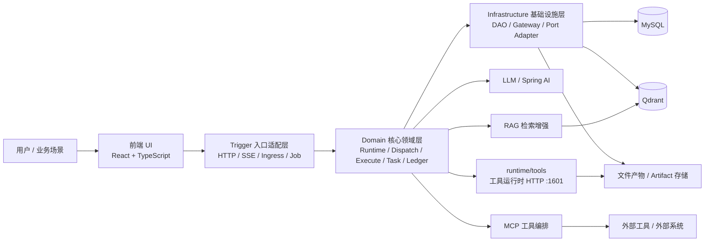
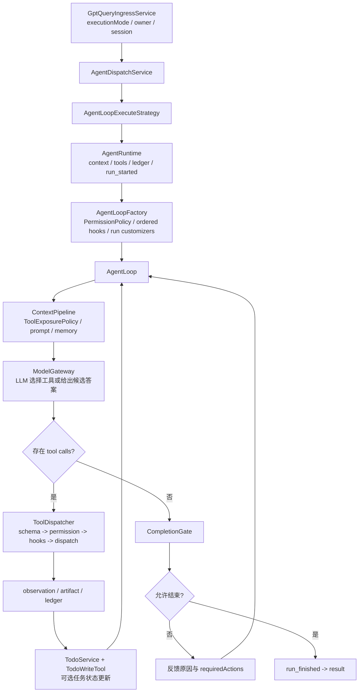

# AI Agent Harness

## 项目简介

`ai-agent` 是一个面向复杂任务自动化与 AI 应用工程化落地的可审计 Agent Harness。
主运行时采用一条统一的模型—工具循环：`AgentRuntime` 创建单次运行上下文，并通过可注入的
`AgentLoopFactory` 为每个 run 组装独立 `AgentLoop / HookBus`；`AgentLoop` 通过
`ContextPipeline + ModelGateway` 请求模型，`TodoService` 维护任务进度，`CompletionGate`
在结束前检查证据与完成条件。MCP、Skills、RAG、会话记忆、artifact、执行账本与历史回放
作为同一条主链路的横切能力接入。

> 项目参考 Claude Code 的公开 Harness 思路，但不宣称是其替代品，也不宣称已经具备
> 分布式 durable execution、exactly-once 或完整的权限控制面。

本次架构对齐固定参考以下公开快照（2026-07-17），避免后续上游变更导致设计依据漂移：

- [shareAI-lab/learn-claude-code@a9cafe9](https://github.com/shareAI-lab/learn-claude-code/commit/a9cafe953aa714f9cb1171f217d96bd2734bbcc7)：教学实现；
- [claude-code-best/claude-code@b4149bb](https://github.com/claude-code-best/claude-code/commit/b4149bbf7391ad62f82734314d5c7c250c6c7b59)：逆向恢复/社区实现，并非 Anthropic 官方源码。

本项目借鉴的是可公开观察的 Harness 行为契约，不把任一仓库当作 Claude Code 内部实现的权威来源，
也不复制其全部文件组织与产品能力。

### ChatGPT Work 垂直切片

新增 `/api/agent/work` 控制面和 `WorkspaceTasks` 四列看板：

- `TodoService` 仍是 run-local 步骤与 evidence，不承担跨会话协作。
- `WorkspaceService` 管理项目级 instructions 与 tool policy 边界。
- `TaskGraphService` 管理 work item 的 `blockedBy / blocks`、认领、状态迁移和完成后自动解锁。
- 前端独立展示 `Ready / In progress / Blocked / Completed`，不会把 TaskGraph 混入聊天 Todo。

当前工作区、任务节点、依赖关系与审计事件已由 JDBC repository 持久化到 MySQL，并保留内存 repository
用于领域测试；它支持跨 Agent 进程重启恢复任务图，但不等同于运行中 Agent Loop 的 checkpoint/resume。

## 解决的痛点

- 单轮问答难以承接复杂任务，缺少显式待办、工具证据与完成条件
- 工具调用往往是一次性动作，搜索、分析、报告等中间结果文件难沉淀、难复用
- **多步骤**任务过度依赖 Prompt 临场发挥，容易跑偏、漏步骤或过早宣称完成
- 执行过程缺少结构化记录，出现问题后难审计、难回放、难定位
- AI 能力与业务系统之间常常存在落地鸿沟，Demo 能跑，但工程体系难以长期演进
- Agent能力难以拓展，新增能力成本过高

## 推荐主闭环：复杂研究报告

为了让网页演示聚焦，推荐使用一条稳定的主场景验证 Harness：

```text
用户提出研究问题
  -> Agent 建立 Todo
  -> Deep Search / 文件 / RAG 收集证据
  -> 工具结果沉淀为 artifact
  -> Report 生成可预览产物
  -> CompletionGate 检查覆盖、证据和产物
  -> 缺项写回同一 Agent Loop 定向补齐
  -> run_finished(SUCCESS) -> result
```

网页端只展示用户可验证的阶段、Todo、工具结果、产物和验收结论，不展示内部 chain-of-thought。
`AUTO / STANDARD / DEEP` 仍然是同一 Agent Loop 的执行强度选择，不是三套运行时。

### 工具分层

- **常驻工具**：Todo、文件、基础分析等 Harness 控制能力；保证每轮都能维护任务和读取必要输入。
- **条件工具**：联网搜索、用户文件、用户 MCP 等，按请求的 `online`、附件和权限注入。
- **延迟工具**：大规模 MCP 或低频业务工具，通过 `tool_search + execute_extra_tool` 按需发现和执行，避免工具 schema 一次性占满上下文。

这套分层既服务模型选择，也服务网页解释：用户看到的是“正在搜索 / 分析 / 生成报告”，而不是一串难以理解的内部工具名。

## 目标用户

- 想构建 Agent Harness、复杂工作流或 AI 自动化系统的后端工程师
- 需要把检索、分析、报告、脚本执行等工具能力串成闭环的业务技术团队
- 想学习工具调用、上下文工程、执行治理与可审计 Agent 的开发者

## 典型应用场景

- **多步骤**任务编排与结果汇总
- 知识检索与**图文混合**问答
- 数据分析与报告生成
- 复杂业务流程中的工具编排与结果验收


## 展示图与报告样例（待自建）

旧的 `assets/readme` 展示图与样例报告已移除（非当前环境产物，不再使用）。
展示材料请用**本机重跑**后的截图与报告重新生成，步骤见文末「后续待办：演示截图与展示材料」。

建议主演示闭环仍是：联网研究 → Todo（DEEP）→ 工具产物 → 完成门禁 → 可预览报告/图片。

## 技术栈

- 后端：Java 21、Spring Boot 3.5、Spring AI 1.1、MyBatis、OkHttp SSE
- 数据层：MySQL、Qdrant
- 多模态智能检索：RAG、**多路混合**召回、Rerank、多轮检索
- 前端：React 19、TypeScript、Vite、Ant Design

## 系统架构图



## 核心能力

### 1. 统一 Agent Loop

- `AgentRuntime` 负责 run-local 上下文、工具目录、账本与终态协议，`AgentLoop` 负责模型—工具循环
- `AgentLoopFactory` 是可注入的 Harness 装配边界：Spring 可提供 `PermissionPolicy`、有序 Hooks 与 `RunCustomizer`，每个 run 重新创建可变 `HookBus` 和循环实例，避免跨请求状态泄漏
- `ContextPipeline` 生成当前轮上下文和可见工具，`ModelGateway` 隔离底层 LLM，`ToolDispatcher` 统一 ID/Schema 校验、权限、Hook、执行、证据与账本
- `AUTO / STANDARD / DEEP` 是同一运行时的 `executionMode`，不是三套 Agent；它们改变 Todo 与验收强度，不能绕过确定性完成校验，`DEEP` 强制显式 Todo
- `TodoService` 是运行内唯一任务状态源，`TodoWriteTool` 只是模型适配器；每轮 system prompt 尾部注入 fresh `current_todo_state`，压缩后仍保留 completed prefix、唯一 `in_progress` 与 pending suffix，并用当前步骤驱动工具预选
- DEEP Todo 的每一步显式声明 `NONE / TOOL` evidence policy，并在进入步骤时生成独立 `activationId`：`NONE` 步骤只能通过 `todo_write` 更新，`TOOL` 步骤只能消费当前步骤、当前 activation 内新产生且尚未消费的真实工具证据；禁止跨步骤、跨 activation、重复消费 evidence，也禁止用 `ToolOperationLedger` 的 reused 结果证明新步骤。历史 Todo 缺少新字段时按 `LEGACY` 兼容回放
- `CompletionGate` 检查未完成 Todo、未解决工具失败、必需 artifact 与最终覆盖；多对象比较必须逐 `subject × dimension` 提供实质内容，拒绝时把修正动作写回同一上下文继续当前项
- `ToolInvocationContract` 将用户明确提出的“必须、只能、禁止调用某工具”解析为 run-level `required / allowed / forbidden / exclusive` 集合，并同时约束工具暴露、权限判断和最终 evidence；Harness 控制工具 `todo_write` 不会因此被误禁用
- `CompletionOutputContract` 只保守提取用户明确要求输出的两个及以上 `snake_case` 字段，最终门禁检查字段名是否出现；普通问题、单字段解释和否定句不会被擅自扩展成输出契约，它也不替代字段值、类型和业务语义校验
- MCP transport/`isError`/空结果统一为 typed failure；取消 Future 会向下 dispose 模型 Flux，模型调用、远程流工具和并发工具批次共享同一 run deadline
- `run_finished` 是权威运行终态，只有 `status=SUCCESS && completionGatePassed=true` 才表示成功；`result` 只承载最终内容与 metrics
- 历史回放合成同样的 `run_started -> run_finished -> result` 生命周期，并保留 `SUCCESS / FAILED / STOPPED / TIMEOUT`、`completionGatePassed` 与 `stopReason`

### 2. 共享工作区与工具组合执行

- 搭建工具产物登记与可见性机制，将搜索结果、分析文件、报告、图片、多模态检索结果统一沉淀到会话级工作区
- 支持跨工具传递、上下文续用与任务级结果串联，形成 `搜索 -> 分析 -> 报告 -> 汇总` 的**多工具组合闭环**
- 让前序工具生成的文件与中间结果可以被后续工具直接复用，避免链路割裂和重复处理

### 3. 基于安全声明的多工具调度

- 同一轮多个 `tool call` 默认串行；只有工具显式声明 `isConcurrencySafe(input)` 的连续安全调用才使用 CompletableFuture 并行
- Todo、报告、代码、文件生成和未知 MCP 等副作用/未知能力不会被自动并发；所有路径仍统一事件、artifact、证据、账本和取消语义
- `ToolOperationLedger` 在单次 run 内按“规范化工具名 + 规范化 JSON 参数”的 SHA-256 key 复用已经成功的相同调用，避免重复副作用；失败调用和参数不同的调用仍可再次执行，轮询/实时读取工具可通过 `allowRepeatedSuccessfulCall=true` 显式退出复用
- 复用只减少真实工具执行，不免除模型请求产生的 tool-call 预算计数，也不等价于跨 run 幂等、exactly-once 或 durable 去重

### 4. Skill + Todo 工作管理体系

- Skill 按需加载领域知识与受控脚本，TodoWrite 在统一 Agent Loop 内维护复杂任务的可见步骤与状态
- DEEP 模式要求 Todo、工具证据、完成门禁和最终校验一致通过，不再依赖独立 SOP 预规划服务
- 计划更新与实际执行共享同一上下文、账本和取消边界，避免 Planner / Executor 双轨状态漂移

### 5. RAG 与混合检索增强

- 基于 Qdrant 搭建 **语义向量召回 + BM25 关键词召回 + 文本到图片/页面的跨模态混合检索体系**
- 结合**查询重写**、**子问题扩展**、**多轮检索**与**重排序**机制，提升图文混合知识场景下的检索相关性
- 支持复杂知识任务中的**证据补全**、上下文增强与多源内容融合

### 6. MCP管理

- 在运行时构建 `McpRegistry + McpToolExecutor` 统一管理 MCP 服务，启动后可对全局启用或指定客户端绑定的 MCP 做预热、工具发现与缓存，减少每次请求都重新建连和重复 `listTools` 的开销
- 支持三种 MCP 传输协议：`SSE`、`STDIO` 与 `Streamable HTTP`
- 开发 seed 默认启用两个仓库内置、无第三方密钥的只读 STDIO Server：`project-knowledge` 提供项目知识/流程查询，`agent-utility` 提供与 Java 额度结算一致的整数微额度计算，共 4 个带命名空间的工具
- Python 与 Java 测试均真实覆盖 `initialize -> tools/list -> tools/call`；当前业务运行时消费的是 MCP Tools 能力，不宣称已经接入 Resources、Prompts、Sampling 等全部协议能力
- 内置 Server 主要用于可复现地展示跨语言协议协商、动态工具发现和安全边界；不默认执行第三方 `npx/uvx` 服务，避免未经审计的子进程继承 Agent 模型密钥

### 7. 执行事实持久化与历史回放

- 统一记录对话过程产生的执行事实，覆盖对话运行、LLM 调用、工具调用、工具输出、文件产物等关键节点
- 支持复杂任务链路的审计、问题定位与历史回放，提升 Agent 系统的可观测性与可维护性
- 工具账本分离保存面向用户的 `tool_result` 与面向模型的 `llm_observation`；历史 projector 优先回放前者，旧记录缺失时才回退后者
- 通过结构化工具输出与 artifact 引用，支持前端按历史记录稳定恢复结果展示

### 8. 上下文工程与结构化记忆

- Agent Loop 使用统一 `ContextManager`，将消息、系统提示、记忆、工具 schema 和安全余量纳入同一 token 预算
- 所有 Web 对话和定时任务都进入统一 Agent Loop；任务图与 run-local Todo 是工作管理能力，不再通过独立 Workflow 运行时绕过 Harness
- 将网页、工具输出和召回内容标记为不可信数据，大型 observation 压缩为摘要与 artifact/evidence 引用
- 将长期记忆收敛为 `PREFERENCE / FACT / PROCEDURE`，带 owner、source、confidence、version、TTL、稳定 upsert key 与删除边界
- 自动写入采用显式准入：普通问答不进入长期记忆；只有用户明确声明的偏好、事实或流程才写入，回答语言/风格使用稳定语义槽位覆盖更新
- 本地作品集环境默认开启跨会话长期记忆；首次保存按真实 embedding 维度幂等创建 Qdrant 集合，并为 owner/记忆/会话过滤字段创建 keyword 索引。它与 `AGENT_GROUP_QDRANT_ENABLED` 控制的 DataAgent 问数能力相互独立

固定角色配置也不会选择执行内核：`AgentProfileResolver` 只把角色绑定的 client、步骤提示词和 MCP 范围解析为可信 Harness profile，`AgentDispatchService` 始终进入 `AgentType.AGENT_LOOP`。数据库中的 `ai_agent.strategy`、`ai_agent.flow_step_count` 与 `ai_agent_flow_config` 是迁移前沿用的存储命名，其中 `ai_agent_flow_config` 当前承载“角色 -> client + procedure prompt”绑定；它们不能恢复 Workflow/ReAct/Plan-Solve 运行时。后续若重做角色管理后台，可用独立幂等迁移将这些列和表重命名为 profile 语义，不应在当前已有角色数据上直接删除。

### 9. 可复现 Agent Eval

- 上下文续写 benchmark 在同一 12K `o200k_base` 预算下比较硬截断与滚动摘要，不再混用 token/字符单位
- 离线 Harness eval 覆盖偏好变化、冲突/无关记忆、Prompt Injection 与工具失败，并输出 `pass@k`、`pass^k`、memory precision/recall 和 token cost
- CompletionGate 覆盖 Todo 完成度、工具失败、所需报告 artifact 与最终回答；零 Token 确定性 FinalVerifier 对所有 profile 生效，`DEEP` 额外强制 Todo
- 测试/引用等 outcome 通过结构化 evidence 扩展，不从自然语言猜测 required outcome

### 10. 工具选择与运行治理

- `AgentToolCollectionFactory` 只构建当前请求允许使用的 run-local 工具目录，不把系统全部能力无条件交给模型
- `ToolExposurePolicy` 再为每一轮生成可见且可执行的浅视图：内置工具直接暴露；大规模 MCP 目录使用固定 schema 的 `tool_search` + `execute_extra_tool`，发现结果只授权代理执行，不把目标原生 schema 动态塞回后续轮次
- 用户明确禁止工具时使用 `ToolChoice.NONE` 并清空当前轮工具视图；`online=false` 会排除 `deep_search`、`web_fetch`、远程 SSE / Streamable HTTP MCP 和用户 MCP，但管理员配置、受信任的本地 STDIO MCP 仍可直接执行，或在超过 inline 阈值时通过同一固定代理搜索和执行
- 用户明确要求联网查证时，离线或没有网络检索工具会以 `REQUIRED_CAPABILITY_UNAVAILABLE` fail-fast；即使目录中有工具，也必须产生成功的网络检索 evidence 才能通过 CompletionGate
- 缺失 toolCallId 在模型响应边界生成唯一 ID；空 ID、重复 ID 或不符合工具 Schema 的调用会在任何副作用发生前整批拒绝
- `AgentRunBudget` 同时限制 turns、tool calls、completion attempts、运行时长、Token 与 microcredits
- `AgentStopReason` 明确区分完成、重复轮次、能力不可用、各类预算耗尽、模型错误和执行错误，避免失败被误报为成功

## 统一执行链路



前端只消费 canonical events：`run_started`、`phase_changed`、`todo_snapshot`、
`tool_call`、`tool_result`、工具专属 artifact 事件、`verification_started`、
`verification_result`、`completion_blocked`、`run_finished` 和终态 `result`。

## 验证快照（2026-07-18）

- Agent 当前 Surefire 报告汇总：`508` tests，`0` failures，`0` errors，`0` skipped。
- 前端本轮实际执行 `pnpm test`：`47` test files、`192` tests 全部通过；ESLint 与生产构建通过。
- 双账号浏览器闭环已验证：A 开团并支付后团队仍开放，B 参团支付后显式封团，双方各到账 60 点永久额度；
  随后 DEEP Agent Loop 使用 `todo_write` 与 `code_interpreter` 完成 2/2 Todo 和最终验证。
- 真实 `qwen-plus` 浏览器验收调用两次 `platform_context`，完成
  `tool_call -> tool_result -> verification_result(passed) -> run_finished(SUCCESS) -> result`；账户卡片显示
  付费额度 `120` 点，订单卡片显示最近 `2` 笔，重新打开最近会话后两张卡片仍由 typed projector 还原。
- 工具账本新增 `tool_result` 后，实时 UI 结果与模型 `llm_observation` 不再混用；旧账本缺少该列数据时保留回退策略。
- 浏览器已验收桌面双栏与 `390x844` 移动单栏：移动端可切换全宽工作区，页面无横向溢出，本轮无新增控制台错误。

## 项目结构

以下仅列出当前已纳入 Git 版本控制的核心目录与文件：

```text
ai-agent/
├── ai-agent-types/                              # 基础类型层
│   └── src/main/java/com/linrun/agent/types/
│       ├── common/Constants.java                    # 全局常量
│       ├── exception/AppException.java              # 应用异常基类
│       ├── exception/BizException.java              # 业务异常
│       ├── enums/ResponseCode.java                  # 统一响应码
│       ├── agent/config/AgentExecutorProperties.java # Agent 执行器配置
│       ├── agent/config/AgentExecutorNames.java     # 执行器名称常量
│       └── agent/owner/OwnerRequestContext.java     # 可信 owner 请求上下文
├── ai-agent-api/                                # API 契约层
│   └── src/main/java/com/linrun/agent/api/
│       ├── IAiAgentService.java                     # Agent 主服务契约
│       ├── IAiClientToolMcpAdminService.java        # MCP 管理契约
│       ├── dto/AiClientToolMcpRequestDTO.java       # MCP 配置 DTO
│       └── response/Response.java                   # 统一返回体
├── ai-agent-trigger/                            # HTTP / SSE / Ingress / Job 入口适配层
│   └── src/main/java/com/linrun/agent/
│       ├── trigger/
│       │   ├── http/AiAgentController.java              # 唯一 Agent HTTP/SSE 主入口
│       │   ├── http/dataagent/DataAgentController.java  # 数据 Agent 入口
│       │   ├── http/agent/AgentConversationHistoryController.java # 历史会话接口
│       │   ├── http/agent/AgentFileController.java      # 文件接口
│       │   ├── http/admin/AiClientToolMcpAdminController.java # MCP 后台管理
│       │   ├── http/reactor/support/SseEmitterAgentSessionStream.java # SSE 输出适配
│       │   ├── service/GptQueryIngressService.java      # 请求收敛与入口校验
│       │   └── job/AgentTaskJob.java                    # 定时任务入口
├── ai-agent-domain/                             # 领域核心
│   └── src/main/java/com/linrun/agent/domain/agent/
│       ├── dispatch/AgentDispatchService.java       # 执行策略路由
│       ├── execute/                                 # Agent Loop 执行策略
│       ├── armory/                                  # 能力装配领域服务
│       ├── task/                                    # 任务服务
│       ├── runtime/AgentRuntime.java                # 运行时组合根与终态协议
│       ├── runtime/AgentLoopFactory.java            # 可注入的 run-local Harness 工厂
│       ├── runtime/agent/AgentContext.java          # 单次运行上下文
│       ├── runtime/agent/BaseAgent.java             # Agent 公共执行骨架
│       ├── runtime/agent/AgentLoop.java             # 模型—工具循环
│       ├── runtime/loop/ContextPipeline.java        # 当前轮上下文与工具视图
│       ├── runtime/loop/ModelGateway.java           # 模型边界
│       ├── runtime/tool/dispatch/ToolDispatcher.java # 工具分发管线
│       ├── runtime/tool/dispatch/ToolInputSchemaValidator.java # 副作用前 Schema 校验
│       ├── runtime/harness/AgentRunBudget.java      # run-local 复合预算
│       ├── runtime/harness/StopGate.java            # 机械停止门
│       ├── runtime/harness/CancellationToken.java   # 结构化取消
│       ├── runtime/harness/PermissionPolicy.java    # 调用权限
│       ├── runtime/harness/HookBus.java             # typed hooks
│       ├── runtime/completion/DefaultCompletionGate.java # 完成门禁
│       ├── runtime/completion/DefaultEvidenceValidator.java # typed evidence
│       ├── runtime/work/TodoService.java            # 唯一 Todo 状态源
│       ├── runtime/tool/common/TodoWriteTool.java   # Todo 模型适配器
│       ├── runtime/tool/exposure/ToolExposurePolicy.java # 每轮工具暴露策略
│       ├── runtime/llm/LLM.java                     # LLM 调用封装
│       ├── runtime/llm/StreamResponseHandler.java   # 流式响应处理
│       ├── runtime/tool/ToolCollection.java         # 工具集合
│       ├── runtime/tool/factory/AgentToolCollectionFactory.java # 工具装配工厂
│       ├── runtime/tool/mcp/runtime/McpRegistry.java # MCP 运行时注册中心
│       ├── runtime/tool/mcp/runtime/McpToolExecutor.java # MCP 工具执行器
│       ├── runtime/tool/skill/DefaultSkillRegistry.java # Skill 注册中心
│       ├── runtime/artifact/ToolArtifactRegistry.java # 工具产物登记
│       ├── runtime/executor/AgentExecutorSupport.java # 并发执行器封装
│       ├── memory/SessionContextMemoryService.java  # 会话记忆入口
│       ├── ledger/AgentExecutionRecorder.java       # 执行账本写接口
│       ├── ledger/ExecutionLedgerQueryService.java  # 执行账本读接口
│       ├── ledger/ExecutionLedgerRunSupport.java    # 运行账本辅助
│       ├── ledger/replay/ConversationHistoryReplayService.java # 历史回放服务
│       ├── ledger/replay/projector/ToolInvocationProjectorRegistry.java # 工具回放投影注册
│       ├── rag/DataAgentQueryService.java           # 数据问答领域入口
│       ├── rag/Nl2SqlQueryService.java              # 自然语言转 SQL
│       ├── rag/SchemaRecallService.java             # Schema 召回
│       └── role/FixRoleService.java                 # 固定角色服务
├── ai-agent-infrastructure/                     # 基础设施层
│   └── src/main/java/com/linrun/agent/infrastructure/
│       ├── adapter/repository/AgentRepository.java  # Agent 仓储实现
│       ├── adapter/repository/ExecutionLedgerWriteRepository.java # 账本写仓储
│       ├── adapter/repository/ExecutionLedgerReadRepository.java # 账本读仓储
│       ├── adapter/repository/ChatModelMetadataRepository.java # 模型元数据仓储
│       ├── adapter/port/OkHttpRemoteStreamAdapter.java # 远端流式适配
│       ├── adapter/port/OkHttpRemoteHttpAdapter.java # 远端 HTTP 适配
│       ├── adapter/port/ReactorToolFileArtifactAdapter.java # 工具产物适配
│       ├── tooloutput/ToolOutputWriterImpl.java     # 工具输出持久化
│       ├── tooloutput/ToolOutputReaderImpl.java     # 工具输出读取
│       ├── dataquery/DataQueryExecutionAdapter.java # 数据查询执行适配
│       ├── dataquery/DataQueryMetadataAdapter.java  # 数据元信息适配
│       ├── gateway/ReactorFileGateway.java          # 文件网关
│       ├── gateway/ReactorImageGenerationGateway.java # 图像生成网关
│       └── dao/reactor/                             # DialogueRun / ToolInvocation / ToolOutput 持久化 DAO
├── ai-agent-app/                               # 启动与装配层
│   ├── src/main/java/com/linrun/agent/Application.java    # Spring Boot 启动入口
│   ├── src/main/java/com/linrun/agent/config/AgentExecutorConfiguration.java # 执行器装配
│   ├── src/main/java/com/linrun/agent/config/AiAgentAutoConfiguration.java # Agent 主装配
│   ├── src/main/java/com/linrun/agent/config/AiAgentSkillAutoConfiguration.java # Skill 装配
│   ├── src/main/java/com/linrun/agent/config/reactor/ReactorRuntimeAutoConfiguration.java # Reactor 运行时装配
│   ├── src/main/java/com/linrun/agent/config/reactor/AgentLoopFactoryConfiguration.java # 权限、Hooks 与 run customizer 装配
│   ├── src/main/java/com/linrun/agent/config/reactor/ReplayProjectorAutoConfiguration.java # 历史回放装配
│   ├── src/main/java/com/linrun/agent/config/reactor/DataAgentInitRunner.java # 数据 Agent 初始化
│
├── runtime/                                         # 运行时资产
│   ├── skills/                                      # Skills 技能包（磁盘加载）
│   └── tools/                                       # 工具运行时服务（HTTP :1601，Loop 调用的重执行后端）
├── assets/                                          # 可选：自建 README 截图（默认无，见文末待办）
├── pom.xml                                          # Maven 聚合构建入口
└── README.md                                        # 项目说明

> 平台前端已迁至仓库根目录 `web/`（React / Vite），不再位于本目录下。
```


## 架构说明

项目与同仓库 `group` 工程保持一致，Maven 聚合层固定为
`api / app / domain / trigger / infrastructure / types` 六个子模块，不保留 `ai-agent-application` 第七模块，
也不再保留 `com.linrun.agent.application` 源码包。

- `trigger`：负责 HTTP / SSE、`GptQueryIngressService`、并发守卫、stream 与 job 等入口适配
- `domain`：负责 armory、dispatch、execute、session ownership、task service、Agent Runtime、执行账本、记忆、RAG 与角色能力
- `infrastructure`：负责 DAO、外部服务、文件、远端工具、检索、持久化适配及 `MemberQuotaBillingAdapter`；配额消费者只依赖 `QuotaBillingPort`
- `app`：负责 Spring Boot 装配、配置绑定与运行时启动

Work Management 已落地 run-local `TodoService` 和跨会话 `TaskGraphService` 产品切片；execution ledger 与
历史回放用于审计和投影。TaskGraph 已使用 MySQL 持久化并支持跨进程恢复，但仍不等于运行中 Agent Loop 的
durable checkpoint/resume。
`CheckpointService`、通用 `SubagentRunner` 与 `BackgroundTaskRunner` 尚未实现，也不为架构图完整性创建空壳。


## 后续待办：演示截图与展示材料

> 这是**后续要补的事项清单**，不是系统自动任务。旧展示资源已删，需要重跑后再贴图。

### 和 Agent Loop 的关系（先搞清）

- **现在主路径就是统一 Agent Loop**（`AUTO / STANDARD / DEEP` 只是强度，不是三套旧运行时）。
- **`runtime/tools` 不是旧模式替代品**，也不是第二套 Agent。它是 Loop 里「重工具」的执行后端（Python HTTP，默认 `1601`）。
- 模型在 Loop 里选工具 → Java 调 `deep_search` / `web_fetch` / 生图 / 代码执行等 → **干活在 runtime/tools** → 结果回 Loop 记 artifact / 账本 / 门禁。
- **不打算演示联网搜索、出报告、生图、跑脚本**：可以先不启 runtime/tools，但这些能力在配置里仍指向它，相关演示会失败。
- **要演示「多步骤研究 + 产物」**：需要起 runtime/tools，且这是**当前架构仍在用的**能力。

### 你需要做的事

1. **起环境**：中间件 + `agent_db` 迁移；起 `runtime/tools`；起 `ai-agent-app`；按需起网关/鉴权/会员；起根目录 `web/`。
2. **跑通 2 条对话**（前端选 `STANDARD` / `DEEP`）：
   - STANDARD：联网调研一个技术点，要求有来源小结。
   - DEEP：先 Todo，再搜索取证，最后尽量产出可预览 HTML 报告。
3. **截图**（新建目录 `assets/readme/`，文件名可自定）：
   - 首页对话（含 executionMode）
   - STANDARD 工具时间线
   - DEEP 的 Todo + 验证/补齐痕迹
   - 报告或图片产物预览
   - （可选）额度变化、Work 看板
4. **回写本 README**：在「展示图与报告样例」一节用 Markdown 插图，确认预览能显示；勿提交密钥与隐私。
5. **讲解口径**：Java 管 Loop / Todo / 门禁 / 账本；`runtime/tools` 管搜索等重执行——两者是一层分工，不是新旧两套 Agent。

`runtime/tools` 安装细节见 `runtime/tools/README.md`。

---

## 后续演进方向

- 更灵活的智能体角色配置
- 受限子 Agent 与最小工具集委派（引入前先补齐权限和预算继承）
- 更完善的管理后台、配置中心与可观测性能力
- 更丰富的工具组合
- 在现有 `PermissionPolicy + HookBus` 之上增加面向用户的交互审批控制面、Hook 可观测性与副作用工具幂等协议
- 在统一循环状态模型之上再评估持久化断点恢复与 HITL
- 持续扩充 outcome-based eval，避免只依赖单次演示或 LLM 自评判断 Agent 质量
- 按上文「后续待办：演示截图与展示材料」补齐自有展示材料
