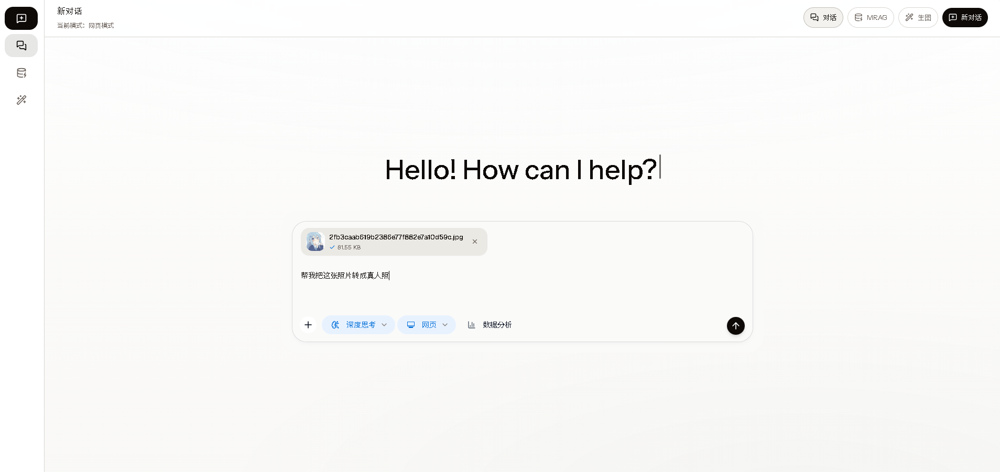
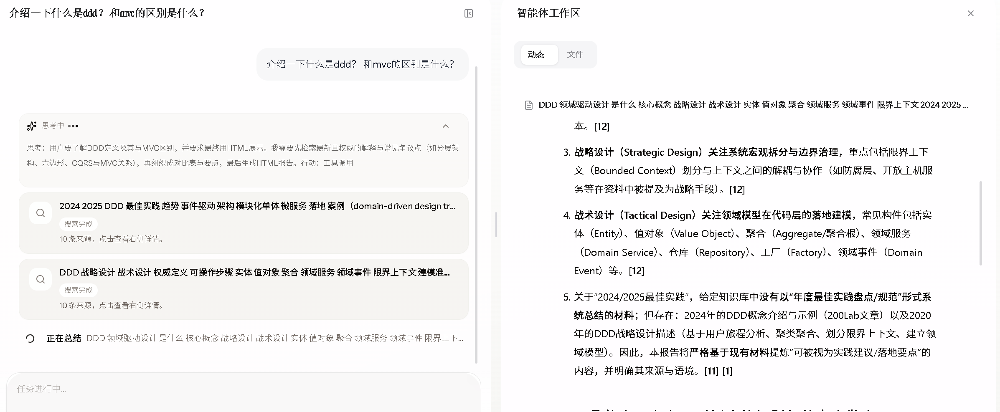
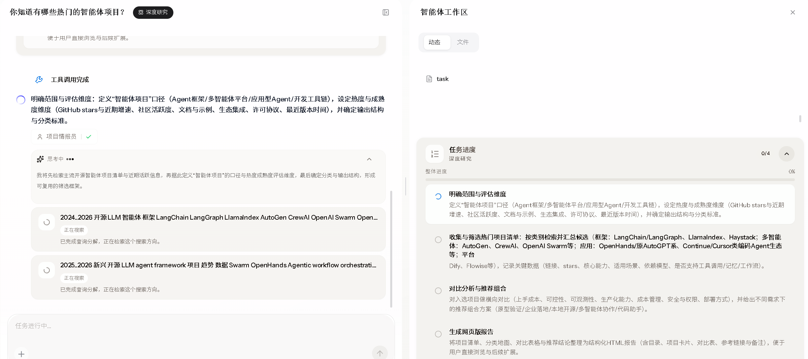
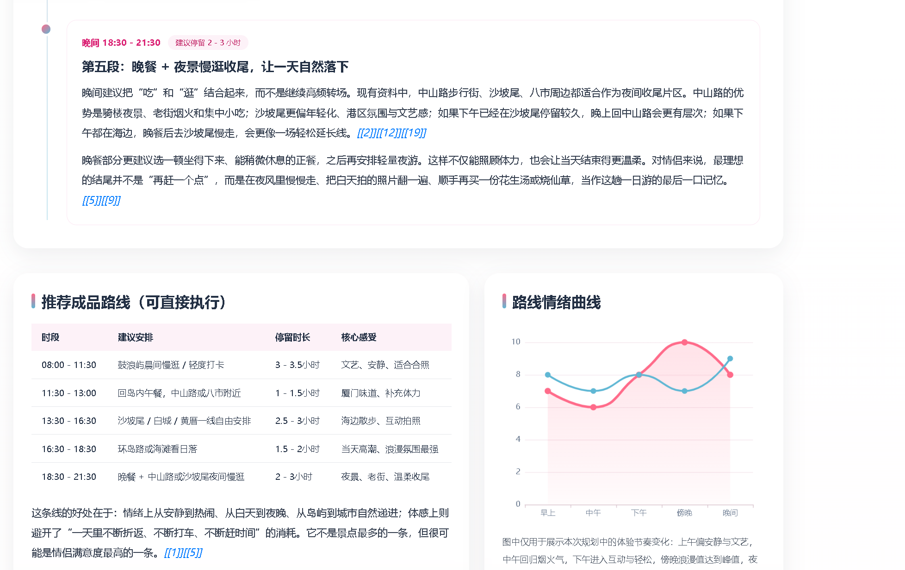
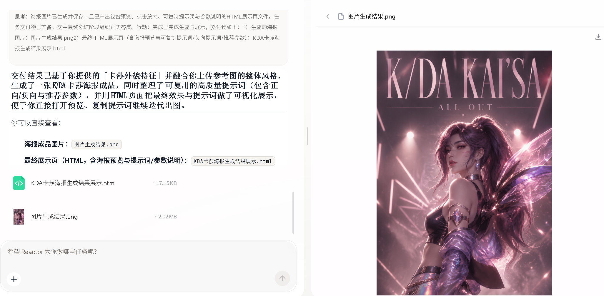
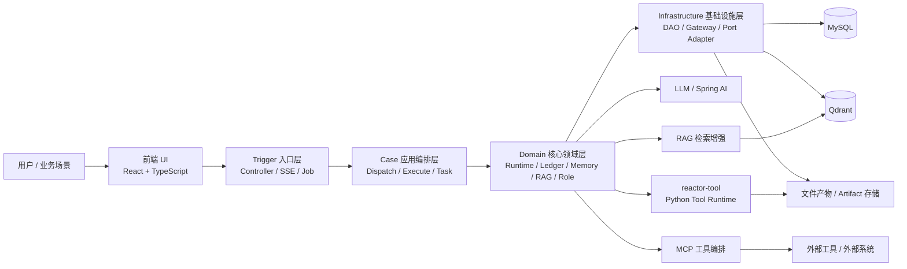
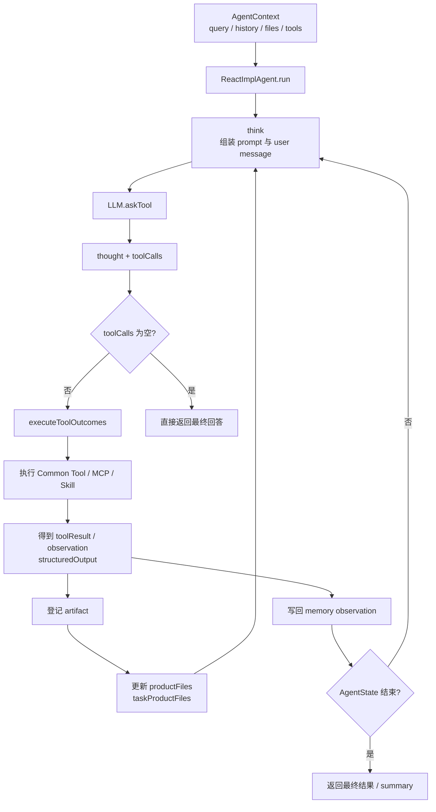
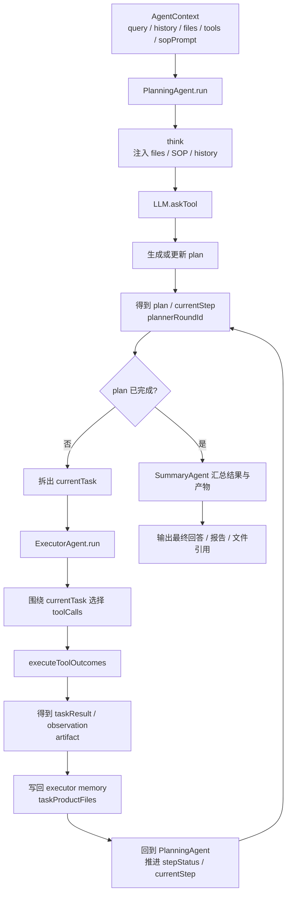

# Reactor 多智能体协同应用平台

## 项目简介

`Reactor-agent` 是一个面向复杂任务自动化与AI应用工程化落地的 **多智能体协同应用平台**。  
它不是只做“单轮对话 + 单次工具调用”的 Demo，而是能把复杂任务拆解、多 Agent 协作、MCP/本地集成工具编排、RAG 检索增强、会话记忆、执行事实持久化与历史回放串成一条可运行、可追踪、可复用的完整执行链路。

## 解决的痛点

- 传统单 Agent / 单轮对话难以承接复杂任务，缺少任务拆解、**分工协作**与**结果汇总**能力
- 工具调用往往是一次性动作，搜索、分析、报告等中间结果文件难沉淀、难复用
- **多步骤**、**长时效**的任务流程过度依赖 Prompt 临场发挥，容易跑偏、漏步骤，执行稳定性不足
- 执行过程缺少结构化记录，出现问题后难审计、难回放、难定位
- AI 能力与业务系统之间常常存在落地鸿沟，Demo 能跑，但工程体系难以长期演进
- Agent能力难以拓展，新增能力成本过高

## 目标用户

- 想构建 **Multi-Agent** 平台、复杂工作流或 AI 自动化系统的后端工程师
- 需要把检索、分析、报告、脚本执行等工具能力串成闭环的业务技术团队
- 想要学习 **Multi-Agent** 协作的学者/学生

## 典型应用场景

- **多步骤**任务编排与结果汇总
- 知识检索与**图文混合**问答
- 数据分析与报告生成
- 复杂业务流程中的子智能体辅助执行


## ✨ Agent Showcase
<p align="center">
  

  
</p>


#### ReAct模式
<p align="center">
  
</p>

#### Plan Execute模式
<p align="center">
  
</p>


## ✨ 典型应用场景示例
#### 1.基于 Deep Research Agent + Report Agent 生成结构化研究报告

> HTML 报告更适合下载后本地打开，Markdown 报告可直接查看源码内容。

| 分类 | 报告名称 | 格式 | 入口 |
| --- | --- | --- | --- |
| 技术评估 | [CodeGraph 开源项目评估报告](assets/readme/CodeGraph开源项目看法与评估.html) | HTML | [打开文件](assets/readme/CodeGraph开源项目看法与评估.html) |
| 模型选型 | [Agent 项目大模型性价比选型决策报告](assets/readme/Agent项目大模型性价比选型决策报告.html) | HTML | [打开文件](assets/readme/Agent项目大模型性价比选型决策报告.html) |
| 场景案例 | [厦门情侣一日游完整规划](assets/readme/厦门情侣一日游完整规划网页版报告.html) | HTML | [打开文件](assets/readme/厦门情侣一日游完整规划网页版报告.html) |
| 场景案例 | [洛克王国新手攻略搜索总结](assets/readme/洛克王国新手攻略搜索总结.html) | HTML | [打开文件](assets/readme/洛克王国新手攻略搜索总结.html) |
| 框架研究 | [Spring AI 框架核心概念与架构演进报告](assets/readme/Spring_AI框架核心概念与架构演进报告.md) | Markdown | [打开文件](assets/readme/Spring_AI框架核心概念与架构演进报告.md) |

#### 报告结果预览
<p align="center">
  
</p>
<p align="center">
  
</p>


#### 2.多工具产物进行复用，结合 Skill 提升图片生成质量
#### Workflow
```text

User Query

    │

    ▼

 Deep Research分析人物外部特征

    │

    ▼

 Skill Selection

    │

    ▼

 Tool Execution

    │

    ▼

 Structured Report / Image Output

```


#### 最终结果
<p align="center">
  

</p>

<p align="center">
  

</p>


## 技术栈

- 后端：Java 17、Spring Boot 3、Spring AI、MyBatis 、OkHttp SSE
- 数据层：MySQL、Qdrant
- 多模态智能检索：RAG、**多路混合**召回、Rerank、多轮检索
- 前端：React 19、TypeScript、Vite、Ant Design

## 系统架构图



## 核心能力

### 1. 多智能体协同与混合模式执行

- 设计并实现 `Plan Execute + ReAct` **混合执行**模式，并结合**动态replan机制**显著提升复杂任务的容错性 可拆解性与最终结果的准确性
- 支持将复杂任务拆解为多个**可并发**子任务，提升复杂场景下的可拆解性、执行效率与协同能力
- 支持**多策略** Agent 动态调度，按业务场景组织不同角色、不同能力的智能体协作完成目标

### 2. 共享工作区与工具组合执行

- 搭建工具产物登记与可见性机制，将搜索结果、分析文件、报告、图片、多模态检索结果统一沉淀到会话级工作区
- 支持跨工具传递、上下文续用与任务级结果串联，形成 `搜索 -> 分析 -> 报告 -> 汇总` 的**多工具组合闭环**
- 让前序工具生成的文件与中间结果可以被后续工具直接复用，避免链路割裂和重复处理

### 3. 基于 CompletableFuture实现多工具并发执行

- 在单个 Agent 的工具执行层支持对同一轮多个 `tool call` 并发调度，统一完成工具调用、事件推送、artifact 记录、账本落库与结果回写，避免“并发执行了，但状态各写各的”的工程失控

### 4. Skill + SOP 标准作业体系

- 构建 Agent 的 `Skill + SOP` 任务编排机制，将专家能力与执行流程模块化沉淀为可复用能力
- 通过显式流程约束和标准作业步骤，增强复杂任务的执行确定性
- 降低模型自由发挥导致的任务跑偏、步骤遗漏和结果不一致问题，提升多步骤任务的完成度与交付一致性

### 5. RAG 与混合检索增强

- 基于 Qdrant 搭建 **语义向量召回 + BM25 关键词召回 + 文本到图片/页面的跨模态混合检索体系**
- 结合**查询重写**、**子问题扩展**、**多轮检索**与**重排序**机制，提升图文混合知识场景下的检索相关性
- 支持复杂知识任务中的**证据补全**、上下文增强与多源内容融合

### 6. MCP管理

- 在运行时构建 `McpRegistry + McpToolExecutor` 统一管理 MCP 服务，启动后可对全局启用或指定客户端绑定的 MCP 做预热、工具发现与缓存，减少每次请求都重新建连和重复 `listTools` 的开销
- 支持三种MCP传输协议 `SSE`、`STDIO` 与 `Streamable HTTP` 

### 7. 执行事实持久化与历史回放

- 统一记录对话过程产生的执行事实，覆盖对话运行、LLM 调用、工具调用、工具输出、文件产物等关键节点
- 支持复杂任务链路的审计、问题定位与历史回放，提升 Agent 系统的可观测性与可维护性
- 通过结构化工具输出与 artifact 引用，支持前端按历史记录稳定恢复结果展示

## 执行链路图

### ReAct 链路



### PlanSolve 链路



两套模式共享的公共底座是 `AgentContext`、`ToolCollection`、`ToolArtifactRegistry` 与 `SessionContextMemoryService`；外围的 Trigger 接入、SSE 推流、执行账本、artifact 持久化与历史回放，作为横切能力统一承接这两条执行链路。

## 项目结构

以下仅列出当前已纳入 Git 版本控制的核心目录与文件：

```text
Reactor-agent/
├── Reactor-agent-types/                              # 基础类型层
│   └── src/main/java/org/wwz/ai/types/
│       ├── common/Constants.java                    # 全局常量
│       ├── exception/AppException.java              # 应用异常基类
│       ├── exception/BizException.java              # 业务异常
│       ├── enums/ResponseCode.java                  # 统一响应码
│       ├── agent/config/AgentExecutorProperties.java # Agent 执行器配置
│       ├── agent/config/AgentExecutorNames.java     # 执行器名称常量
│       └── agent/visitor/VisitorRequestContext.java # 访客请求上下文
├── Reactor-agent-api/                                # API 契约层
│   └── src/main/java/org/wwz/ai/api/
│       ├── IAiAgentService.java                     # Agent 主服务契约
│       ├── IAiClientToolMcpAdminService.java        # MCP 管理契约
│       ├── dto/AutoAgentRequestDTO.java             # 主对话请求 DTO
│       ├── dto/AiClientToolMcpRequestDTO.java       # MCP 配置 DTO
│       └── response/Response.java                   # 统一返回体
├── Reactor-agent-trigger/                            # 入口适配层
│   └── src/main/java/org/wwz/ai/trigger/
│       ├── http/reactor/ReactorController.java      # Reactor 主对话入口
│       ├── http/dataagent/DataAgentController.java  # 数据 Agent 入口
│       ├── http/agent/AgentConversationHistoryController.java # 历史会话接口
│       ├── http/agent/AgentFileController.java      # 文件接口
│       ├── http/admin/AiClientToolMcpAdminController.java # MCP 后台管理
│       ├── http/reactor/support/SseEmitterAgentSessionStream.java # SSE 输出适配
│       └── job/AgentTaskJob.java                    # 定时任务入口
├── Reactor-agent-case/                               # 应用编排层
│   └── src/main/java/org/wwz/ai/application/agent/
│       ├── dispatch/AgentDispatchService.java       # 执行策略路由
│       ├── execute/IExecuteStrategy.java            # 执行策略抽象
│       ├── execute/react/ReactAgentExecuteStrategy.java # ReAct 编排入口
│       ├── execute/planexecute/PlanSolveAgentExecuteStrategy.java # PlanSolve 编排入口
│       ├── execute/workflow/FlowAgentExecuteStrategy.java # Flow 编排入口
│       ├── armory/AgentArmoryApplicationService.java # 能力装配
│       ├── task/AgentTaskApplicationService.java    # 任务编排
│       ├── dataquery/DataAgentApplicationService.java # 数据问答编排
│       └── stream/AgentSessionPrinter.java          # 流式输出打印器
├── Reactor-agent-domain/                             # 领域核心
│   └── src/main/java/org/wwz/ai/domain/agent/
│       ├── runtime/agent/AgentContext.java          # 单次运行上下文
│       ├── runtime/agent/BaseAgent.java             # Agent 公共执行骨架
│       ├── runtime/agent/ReactImplAgent.java        # ReAct 内核实现
│       ├── runtime/agent/PlanningAgent.java         # PlanSolve 规划内核
│       ├── runtime/agent/ExecutorAgent.java         # PlanSolve 任务执行内核
│       ├── runtime/agent/SummaryAgent.java          # 总结收口 Agent
│       ├── runtime/llm/LLM.java                     # LLM 调用封装
│       ├── runtime/llm/StreamResponseHandler.java   # 流式响应处理
│       ├── runtime/tool/ToolCollection.java         # 工具集合
│       ├── runtime/tool/factory/AgentToolCollectionFactory.java # 工具装配工厂
│       ├── runtime/tool/mcp/runtime/McpRegistry.java # MCP 运行时注册中心
│       ├── runtime/tool/mcp/runtime/McpToolExecutor.java # MCP 工具执行器
│       ├── runtime/tool/skill/DefaultSkillRegistry.java # Skill 注册中心
│       ├── runtime/artifact/ToolArtifactRegistry.java # 工具产物登记
│       ├── runtime/executor/AgentExecutorSupport.java # 并发执行器封装
│       ├── memory/SessionContextMemoryService.java  # 会话记忆入口
│       ├── ledger/AgentExecutionRecorder.java       # 执行账本写接口
│       ├── ledger/ExecutionLedgerQueryService.java  # 执行账本读接口
│       ├── ledger/ExecutionLedgerRunSupport.java    # 运行账本辅助
│       ├── ledger/replay/ConversationHistoryReplayService.java # 历史回放服务
│       ├── ledger/replay/projector/ToolInvocationProjectorRegistry.java # 工具回放投影注册
│       ├── rag/DataAgentQueryService.java           # 数据问答领域入口
│       ├── rag/Nl2SqlQueryService.java              # 自然语言转 SQL
│       ├── rag/SchemaRecallService.java             # Schema 召回
│       ├── rag/SopRecallService.java                # SOP 召回
│       └── role/FixRoleService.java                 # 固定角色服务
├── Reactor-agent-infrastructure/                     # 基础设施层
│   └── src/main/java/org/wwz/ai/infrastructure/
│       ├── adapter/repository/AgentRepository.java  # Agent 仓储实现
│       ├── adapter/repository/ExecutionLedgerWriteRepository.java # 账本写仓储
│       ├── adapter/repository/ExecutionLedgerReadRepository.java # 账本读仓储
│       ├── adapter/repository/ChatModelMetadataRepository.java # 模型元数据仓储
│       ├── adapter/port/OkHttpRemoteStreamAdapter.java # 远端流式适配
│       ├── adapter/port/OkHttpRemoteHttpAdapter.java # 远端 HTTP 适配
│       ├── adapter/port/ReactorToolFileArtifactAdapter.java # 工具产物适配
│       ├── tooloutput/ToolOutputWriterImpl.java     # 工具输出持久化
│       ├── tooloutput/ToolOutputReaderImpl.java     # 工具输出读取
│       ├── dataquery/DataQueryExecutionAdapter.java # 数据查询执行适配
│       ├── dataquery/DataQueryMetadataAdapter.java  # 数据元信息适配
│       ├── gateway/ReactorFileGateway.java          # 文件网关
│       ├── gateway/ReactorImageGenerationGateway.java # 图像生成网关
│       └── dao/reactor/                             # DialogueRun / ToolInvocation / ToolOutput 持久化 DAO
├── Reactor-agent-app/                               # 启动与装配层
│   ├── src/main/java/org/wwz/ai/Application.java    # Spring Boot 启动入口
│   ├── src/main/java/org/wwz/ai/config/AgentExecutorConfiguration.java # 执行器装配
│   ├── src/main/java/org/wwz/ai/config/AiAgentAutoConfiguration.java # Agent 主装配
│   ├── src/main/java/org/wwz/ai/config/AiAgentSkillAutoConfiguration.java # Skill 装配
│   ├── src/main/java/org/wwz/ai/config/reactor/ReactorRuntimeAutoConfiguration.java # Reactor 运行时装配
│   ├── src/main/java/org/wwz/ai/config/reactor/ReplayProjectorAutoConfiguration.java # 历史回放装配
│   ├── src/main/java/org/wwz/ai/config/reactor/DataAgentInitRunner.java # 数据 Agent 初始化
│
├── ui/                                              # React 前端
│   ├── package.json                                 # 前端依赖与脚本
│   ├── vite.config.ts                               # Vite 配置
│   └── src/
│       ├── main.tsx                                 # 前端启动入口
│       ├── App.tsx                                  # 应用根组件
│       ├── router/routes.ts                         # 路由定义
│       ├── components/ChatView/index.tsx            # 主聊天视图
│       ├── components/ChatView/useConversationStream.ts # SSE 会话流处理
│       ├── components/Dialogue/index.tsx            # 对话渲染
│       ├── components/Dialogue/PlanSection.tsx      # 计划结果展示
│       ├── services/agent.ts                        # Agent 接口封装
│       ├── services/agentConversation.ts            # 历史会话接口封装
│       ├── services/agentFile.ts                    # 文件接口封装
│       ├── services/imageGeneration.ts              # 图像生成接口封装
│       ├── services/mragWorkspace.ts                # MRAG 工作区接口封装
│       ├── pages/Home/index.tsx                     # 主对话页
│       ├── pages/WorkspaceMRag/index.tsx            # MRAG 工作区
│       └── pages/WorkspaceImageGeneration/index.tsx # 图像生成工作区
├── runtime/                                         # 已纳入仓库的运行时资源与技能目录
├── assets/                                          # 项目静态资源
├── pom.xml                                          # Maven 聚合构建入口
└── README.md                                        # 项目说明
```


## 架构说明

项目整体遵循 DDD 分层设计，并在 Agent 主链路中逐步收敛为以下职责边界：

- `trigger`：负责 HTTP / SSE / Job 等外部入口协议适配
- `case`：负责多智能体编排、任务调度、执行组织与能力协调
- `domain`：负责 Agent runtime、执行账本、记忆、RAG、角色能力等核心领域语义
- `infrastructure`：负责 DAO、外部服务、文件、远端工具、检索与持久化适配
- `app`：负责 Spring Boot 装配、配置绑定与运行时启动


## 后续演进方向

- 更灵活的智能体角色配置
- 更智能的多 Agent 协作策略与角色编排
- 更完善的管理后台、配置中心与可观测性能力
- 更丰富的工具组合
- 构建长期记忆，记录用户偏好与使用习惯，形成稳定用户画像，让智能体在持续交互中更懂用户
