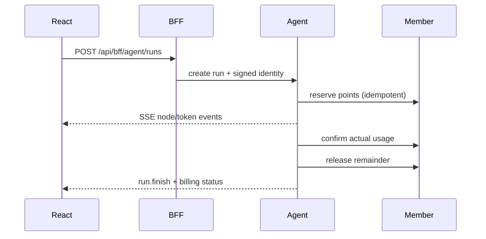

# 服务边界

| 服务 | 数据权威 | 对外入口 |
|---|---|---|
| Gateway | 无业务数据 | `/api/**` |
| Auth | 用户、角色、Sa-Token 会话 | `/api/auth/**` |
| BFF | 页面聚合，不复制状态 | `/api/bff/**` |
| Member | 积分账户、冻结、确认、释放、账本 | `/api/member/**`、`/internal/member/**` |
| Group | 活动、拼团、库存、折扣、成团 | `/api/group/**` |
| Pay | 现金订单、支付宝回调、退款 | `/api/pay/**` |
| Agent | Run、Checkpoint、证据、LLM 用量 | BFF 内部 `/api/**` |

Gateway 先验证 Sa-Token，再生成 `X-User-Id`、`X-Role`、时间戳、Nonce 和 HMAC。BFF 透传这组头给 Agent；Agent 不依赖 Java SDK，也不接受浏览器伪造的身份头。

## Agent 计费时序

